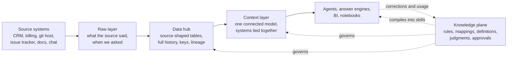

# Vision: a governed data context layer for agents

Last updated: 2026-09-17

This is the general pattern: how any organization can turn the data it already
has into something agents use reliably, and keep it that way. It is not a
description of this repository. [The data flywheel](docs/data-flywheel.md) is
the detailed design of one part of it, the loop that keeps governed knowledge
current. This document is the architecture around that loop: where the data
lives, how it moves, who or what transforms it, and why agents do better on
the result.

## The short version

Agents in real organizations rarely fail because they cannot reason. They fail
because they do not know which of three date columns someone means by
"closed", that the customer in the CRM and the customer in billing are the same
company under different identifiers, or that the revenue figure in a board deck
is not the one in the general ledger. Giving an agent raw access to every
system does not fix that. It turns every question into a fresh
reverse-engineering exercise, answered a little differently each time.

And the questions worth asking cross systems. Which customers are affected by
this bug. Which bookings turned into recognized revenue and which are stuck.
What did this initiative actually cost. Who has access they should have lost.
No single system answers any of those, which is why, in most organizations,
nobody does.

The fix is mostly old. Data engineering has spent decades on it: land the raw
data, integrate it with history, model it the way the business thinks about
itself. Two things are new.

Agents make the slow parts fast. Profiling a source, writing down what each
column means, proposing a mapping, writing the transform, reconciling
duplicates, chasing why a number moved: work that used to take a team weeks per
source is work an agent harness can draft in hours, with people reviewing
rather than authoring.

And the business rules stop being static. They become versioned data, loaded by
agents as skills, and they change from evidence (usage, corrections, source
changes) through a loop a person governs.

The architecture is three layers and a plane beside them.



- **Raw layer.** What each source said, exactly, at the moment it was asked.
  Open files in object storage. Never corrected.
- **Data hub.** The same data in relational tables, still shaped like the
  source, with every version kept, deterministic keys, and lineage on every
  row. Rebuildable from raw.
- **Context layer.** One connected model of how the business sees itself,
  organized by business process and entity rather than by source system. This
  is where the systems are tied together and where most business-rule
  transformation happens, and it is what agents consume. Rebuildable from the
  hub plus the knowledge plane.
- **Knowledge plane.** The rules, mappings, definitions, source contracts,
  findings, human judgments and approvals that govern the other layers. It is
  versioned, and it compiles into the skills agents load. It is not
  rebuildable from anything.

The hub, the context layer and the knowledge plane together are what the
flywheel document calls the grounding layer: governed data between raw sources
and the agent. It has constraints on one side (what the agent may and must do),
checked knowledge in the middle, and verifiers and feedback on the other (what
good means, and whether it happened).

A few principles carry the whole design:

- Nothing is edited in place. Changes append, and history is a query.
- Everything downstream of raw can be rebuilt, except what cannot be re-derived
  from anything: human judgments, approvals, and model outputs already paid
  for. Those are the most valuable data in the system and are treated that way.
- Deterministic first, inference last. Code decides what a stated rule can
  decide. Models handle per-record judgment. Agents handle exploration and
  maintenance.
- Agents mostly write the transforms rather than being the transforms. A rule
  starts as something an agent noticed and hardens into plain code once it is
  clear.
- A person approves a rule once. The pipeline applies it at machine scale.
- Model what the business means once, in the place every consumer will look.
- The relationships between systems are the product. A layer that leaves each
  source in its own lane has done the easy half and skipped the valuable half.
- The most valuable rules are not written down anywhere. They get captured by
  doing the work alongside the people who hold them, not by interviewing them.
- Load only what applies. A context window is attention, not storage.
- A check that cannot fail is not a check.

## The problem, stated plainly

Every organization's data is split across systems that each have their own
identifiers, their own definitions and their own idea of time. The CRM knows
accounts, billing knows customers, the git host knows organizations and
repositories, the issue tracker knows projects and tickets, and none of them
agree on what a customer is. The meaning that joins them lives in people's
heads, in a wiki nobody trusts, and in the SQL of whichever dashboard someone
built last year.

The consequences get worse once agents enter the picture.

Definitions are re-derived at every use. Each analyst, dashboard and now each
agent session reconstructs "active customer" or "closed date" from scratch.
They disagree, and nobody can say which is right because nobody wrote it down
in a place anything checks.

Documentation rots. Every organization that has bought a data catalog knows
this. It is accurate at onboarding and describes a company that no longer
exists within a few quarters, because keeping it current is work with no owner.
Agent instructions written by hand rot the same way, for the same structural
reason.

Nothing owns the space between systems. Each system has an owner, a budget and
an administrator. The relationships between them (this account is that
customer, this commit implemented that request, this invoice settles that
order) have none of those, so they get rebuilt by hand inside each report,
spreadsheet and integration, and every copy drifts separately.

The rules that matter most were never written down. How the accounting team
classifies a journal entry the chart of accounts does not obviously cover,
which reconciling items are timing differences to leave alone and which are
errors to chase, what the month-end close checklist really is as opposed to the
version in the wiki: that knowledge lives in the heads of people who have done
the job for years. It is the difference between an agent that can query the
ledger and one that is useful in finance.

Questions outrun the people who answer them. By the time a dashboard ships, the
question that motivated it has often moved on.

There is decent evidence on what helps an agent here, with a caveat attached.
Semantic layers, meaning governed metric and entity definitions exposed as
data, beat raw text-to-SQL by a wide margin on the queries they cover. The
strongest published number is a vendor benchmarking its own product, scoped to
queries that product defines, so treat the size of the gap as the vendor's
claim. The direction matches everything practitioners report: agents fail on
not knowing what the data means far more often than on writing the query.

Code is a special case worth naming early. It already has an excellent
versioned store, and agents already know how to use git natively. What is
missing is the relationship between code and everything else: which pull
requests fixed which customer-reported issues, which release shipped them,
which incident a change caused. Those links live nowhere, so every question that
crosses the boundary gets answered by hand.

## Layer 1: the raw layer

The raw layer records what each source system said, exactly as it said it, at
the moment it was asked. It adds metadata and nothing else.

### Layout

Open formats in object storage: Parquet for anything tabular, the native format
for anything that is not (documents, email, transcripts, images), each with a
metadata sidecar. One folder per source system, one per entity within it, date
partitions below that, and one file per extract:

```
raw/
  sfdc/
    opportunity/
      extract_date=2026-09-17/
        <extract_run_id>-part-0001.parquet
  github/
    pull_request/
      extract_date=2026-09-17/
        <extract_run_id>-part-0001.parquet
  jira/
    issue/
      ...
  judgments/
    correction/
      ...
```

Hive-style partition names let DuckDB, Spark, Athena and most other engines
query the layer in place, with no load step, which matters more than it seems:
an agent investigating a discrepancy can read the exact bytes a source sent on a
given day without asking anyone to restore anything.

### The metadata envelope

Every record gets the same envelope, added at extract time:

| Field | Why |
|---|---|
| source system and entity | where it came from |
| extract run identifier | joins to a load log recording what the run read, wrote, skipped, and whether it succeeded |
| extracted at | when we asked; the "when did we know it" axis for free |
| extraction method | full, incremental or change-data-capture, because each means something different about deletes and gaps |
| watermark window | the change window this file covers |
| source record identifier | the source's own key, untouched |
| source operation | insert, update or delete, where the source says so |
| source modified at | the source's own change timestamp, when it has one |
| content hash | detects re-sent unchanged records and silent source edits |
| schema fingerprint | detects the source adding, dropping or retyping a field |
| connector version | ties any extraction defect to the code that caused it |

### The rules

Nothing in this layer is ever corrected. Corrections happen downstream, so the
record of what the source said stays auditable. No business logic, no
deduplication, no type coercion beyond what the file format requires.

Append only. Deletes at the source arrive as tombstone records, never as
removed files. The only thing that removes raw data is a retention or legal
policy, and that removal is itself logged.

Schema drift is recorded, not fixed. A new field lands the day it appears,
carried in the file even if nothing downstream reads it yet. The fingerprint
change is a signal for the maintenance loop, described later.

### What else counts as a source

Two kinds of data are not re-derivable from any upstream system, and both
belong here as sources in their own right.

Human judgments: corrections, validations, approvals, ratings, the thumbs-down
on an answer. Nobody can reconstruct a judgment that was lost. Land them
append-only with who or what produced them.

Model outputs already paid for. A model step in a pipeline (described below) is
not reproducible: rerunning it costs money and returns a slightly different
answer. Persist its outputs like source data, keyed by the input's content hash
and the prompt version, so a rebuild reads them rather than regenerating them.

### Where git fits

Code stays in git. The raw layer lands git metadata from the hosting platform:
repositories, pull requests, reviews, commits, releases, tags, each with its URL
and commit identifiers. It does not copy file contents. The context layer will
link to code; agents will read code with git itself.

## Layer 2: the data hub

The data hub is the raw layer made relational and historical, still shaped like
the source systems. A person who knows the CRM can navigate it, and so can a
model, which already carries a great deal of pretraining knowledge about what a
CRM opportunity looks like and what its stage field means. Keeping source names
spends that knowledge instead of throwing it away.

### Shape

One schema per source system, one table per source entity, source field names
kept: `sfdc.opportunity`, `jira.issue`, `github.pull_request`,
`billing.invoice`. Transformation here is light and mechanical: types parsed,
timestamps normalized to UTC with the original offset kept, encodings fixed,
nested child records flattened into their own tables with a parent key.

### History

Every version of every record is kept, effective-dated: valid from, valid to,
an is-current flag, and a hash of the mutable attributes so a reload of
unchanged data writes nothing. That makes "what did this opportunity look like
on the first of the quarter" a filter rather than a restore.

Two time axes matter and are worth keeping distinct from the start. Valid time
is when something was true in the business. Recorded time is when the
organization knew it. A deal backdated to last month is a change to valid time
recorded today. The raw layer's extract timestamps give you recorded time
without extra work; the source's own dates give you valid time. Point-in-time
questions need both, and conflating them is how "the report changed after we
closed the books" becomes unexplainable.

Where a source only offers full dumps, snapshot it on a schedule and derive the
effective-dated history by comparing snapshots. Prefer effective dating as the
stored form, with "as of" snapshots as views over it.

### Keys

Surrogate keys are deterministic hashes of the natural key, never values from a
counter. Any worker computes the same key for the same record without
coordinating with anything, and reloading unchanged data produces zero new rows
by construction.

These details decide whether this holds up:

- Scope the natural key by tenant and source from day one. Two teams or two
  instances of the same system collide otherwise, and because keys derive from
  natural keys, fixing it later means rekeying everything.
- Use a truncated SHA-256, not MD5. The difference is irrelevant
  cryptographically and decisive in compliance review, since many regimes ban
  MD5 outright, and keys end up everywhere.
- Define each key formula exactly once, in both the pipeline language and SQL,
  with a test asserting the two agree. Copies of a key formula that
  disagree about a trailing slash or letter case will silently split one entity
  into two.

### Lineage on every row

Every table carries the same envelope: when the row was created and last
changed, the run that wrote it, the pipeline and business-rules version that
wrote it, the record source, and the change hash. Runs are recorded at three
grains (a batch, a run within it, a step within a run) with every count derived
from the children rather than tallied by the caller, so the audit trail cannot
drift from what the load actually did.

### Standardization and cleansing: an overlay, never an overwrite

This is where models earn a place in the hub, and it is the point most likely
to go wrong.

Models are good at the tedious cleansing that used to be hand-maintained lookup
tables: standardizing company names and addresses, normalizing job titles,
parsing free-text dates, detecting language, classifying a ticket's product
area. Use them. But a hub that stores model-cleansed values in place of source
values has stopped being a record of what the source said. It can no longer be
rebuilt from raw with the same result, and a wrong standardization is now
indistinguishable from the truth.

So the rule is that stated values and derived values never share a column.
Source values stay exactly as landed. Standardized values sit beside them,
clearly marked as derived, each carrying the method that produced it, the model
and prompt version where one was used, a confidence, and a flag when the step
fell back rather than producing a real answer. Downstream layers choose which to
read. Nothing is lost when a standardization turns out to be wrong.

### Deduplication: two different problems

Technical duplicates are the same record arriving twice: a re-sent extract, a
replayed change stream, an overlapping watermark. These are deterministic. The
key and the change hash remove them, and nothing is lost because nothing
distinct was there.

Entity duplicates are two distinct records describing the same real thing: two
CRM accounts for one company, a contact entered under two spellings. These are
judgment calls, and the hub never resolves them by deleting rows. Resolution is
a match table: each record points at a resolved entity, with the evidence, the
method and a confidence. Deterministic rules match what they can. A model scores
the ambiguous candidates. Thresholds, stored as data per domain, decide what
merges automatically, what goes to a person, and what stays separate. Unmerging
is a new row in the match table, not a recovery operation.

### Source contracts

Every source carries a written contract: the assumptions the pipeline makes
about it. Where identity really lives, how deletes arrive, which timestamp means
"modified", what an absent field means, how child records are delivered.

Each assumption is a bet. The contract records it with the measurement that
supports it and a test (a canary) that goes red when it stops being true. Some
lessons learned the expensive way are worth carrying into any contract:

- Identity comes from where the source actually encodes it, verified, not from
  the field that looks like an identifier. A field named for an ID can carry a
  parent's value on every child record.
- Decide what absence means, per field, and write it down. Absent can mean
  false, unknown or not applicable, and a query that treats one as another
  silently drops rows.
- A claim that something never happens cannot be established by a sample
  smaller than the inverse of how rarely it happens. Measure rare-event claims
  across the whole population, or state them as rates with headroom.

"No canary yet" is an acceptable contract entry. Writing the assumptions down is
what makes the missing canaries visible.

### Schema cards

Every hub table gets a schema card: what each column means, sample values, null
rates, distinct counts, how absence is encoded, known traps. Agents draft these
from profiling the data. People who know the source system correct them. They
are the bottom rung of the skill hierarchy described below, and on the evidence
available the most reliably valuable rung.

### The long tail

Not every source deserves a modeled table on day one. Event streams nobody has
asked about yet (webhooks, audit logs, badge readers, security alerts) land in
one generic event table per source with an open event-type registry: id, type,
timestamp, actor, payload, text. New event types are registry rows, not schema
changes. When a consumer needs typed measures from a type, it gets promoted into
a modeled table. One generic table is the right shape for the unmodeled long
tail and the wrong shape for anything someone analyzes, because it has no
declared grain and no typed measures.

## Layer 3: the context layer

The context layer is the organization's data modeled the way the organization
thinks about itself. It is the layer agents consume, and the layer where most of
the business-rule transformation happens.

It is also where the silos end, and that is the main reason it exists. The hub
is deliberately organized by source system, faithful to each one. The context
layer is organized by business process and entity, and its objects are named
for the business (customer, order, invoice, issue, release, employee), never
for a system. Which systems fed a row is a lineage column, not a table prefix.
A context layer whose tables still read like a copy of the CRM has not been
built yet.

### Why dimensional

A star schema was designed so that people who do not know the plumbing can
still query correctly: facts that record what happened, at a declared grain,
surrounded by dimensions that describe who, what, where and when, joined by
simple and predictable paths. The same property helps agents. The join paths are
short and uniform, the names are the business's names, and SQL over that shape
is something models write well.

It is also old, which is the point. Frameworks that abstract agent behavior
churn faster than the research they wrap. A model of what happened in what
context has been stable for decades and does not care which model or harness
reads it.

### Shape

Facts are business processes: bookings, invoicing, support, delivery, releases,
incidents, hiring. Each has its grain stated as a sentence before anything is
built ("one row per pull request merged into a default branch"). When in doubt,
go finer, because detail you did not keep cannot be aggregated later.

Conformed dimensions are the entities every process shares: customer, product,
employee, team, repository, date. They are what make one process comparable to
another, and building them is where cross-system identity gets resolved. The
customer dimension is where "this CRM account, this billing customer and this
git-host organization are one company" is decided, from the hub's match tables
and the crosswalk rules in the knowledge plane.

A few structural rules keep it sane:

- Facts never join facts directly. Two processes relate through a conformed
  dimension.
- Many-to-many relationships are bridge tables: pull request to issue, issue to
  release, release to customer.
- Dimensions whose attributes change keep history, closing the old row and
  opening a new one, so "which segment was this customer in when the deal
  closed" is answerable.
- Facts carry the dimension attributes they were produced under, stamped at
  load time, so "accuracy by version" or "revenue by the territory at the time"
  is a filter rather than a reconstruction.

### The relationships are the point

A customer dimension is not valuable because it is a tidy list of customers. It
is valuable because it is the place where the CRM account, the ERP customer,
the billing subscription, the support organization and the product tenant are
declared to be one company, so a question can start in one system and end in
another. Everything an organization actually wants to know crosses that
boundary.

Edges come in a few kinds, and they are built differently:

- **Identity**: the same real thing represented in several systems. One
  company, five identifiers. One person as an employee record, a git account, a
  chat handle and a badge number.
- **Reference**: one record names another. A commit message carrying an issue
  key, an invoice carrying a purchase-order number, a journal entry carrying a
  source-document identifier.
- **Process chains**: one business event causes the next. An opportunity
  becomes a quote, an order, an invoice, a payment, a journal entry, a revenue
  schedule.
- **Attribution**: which change produced which outcome. Which release contained
  the fix, which deploy preceded the incident, which campaign produced the lead,
  which work is capitalizable.

Build each edge by the cheapest reliable method available, in this order: an
identifier one system already stores about the other (getting the ERP customer
number recorded on the CRM account is often the highest-return integration work
available, and it is a conversation, not a pipeline); a parsed reference, like
issue keys in branch names; deterministic matching on normalized attributes
(legal name, domain, tax identifier); model-scored candidate matching for the
ambiguous remainder; and a person asserting the link, which is a judgment and
belongs in the knowledge plane with the rest of them.

Every edge records how it was made, its confidence, the evidence behind it, and
the period it applies to. An edge a person asserted and an edge a model guessed
must never look the same in a query, because the second is what a confidently
wrong answer gets built on. Edges are effective-dated like everything else:
accounts get reassigned, subsidiaries get merged, employees change cost centre,
and a link that was right last year is not a link that is right today.

Conform to a spine rather than mapping pairwise. Every source maps into the
shared dimensions once, and is then related to every source already there.
Point-to-point mappings between systems multiply with each addition, and each
one decays on its own schedule. This is why the next source costs less than the
last one, and it is the entire economic argument for the layer.

Coverage is a measured property, not an assumption. For each edge type, report
what fraction of records link and how many are orphans, and put that number
next to any answer that traversed it. An invoice with no opportunity, a commit
with no issue, a payment matched to nothing: each is either a data problem or a
business reality, and finding out which is exactly the knowledge this layer
exists to capture. Orphans are findings, not noise.

Traversal stays relational: joins along conformed keys, recursive queries for
hierarchies like org charts and account trees. The relationships are
graph-shaped in meaning and relational in storage, and a graph view can be
derived for any consumer that wants one.

Each chain worth walking gets documented as a skill: the hops, which ones are
lossy, where coverage is thin, and the traps. Some chains that earn their keep
in most organizations:

| Chain | Systems it crosses | What it unlocks |
|---|---|---|
| lead to cash | CRM, quoting, ERP, billing, ledger | which bookings became recognized revenue, and which are stuck where |
| idea to production | roadmap, issue tracker, git host, CI, deploy, support | which customers asked for what shipped, and whether it reached them |
| procure to pay | procurement, vendor master, accounts payable, ledger, bank | what was committed, received, and actually paid |
| hire to retire | HR system, identity, service desk, payroll, ledger | who has access they should have lost, and what a team costs |
| effort to cost | issue tracker, git host, HR system, payroll, ledger | which product work is capitalizable, and what an initiative cost |

That last row is the shape people find surprising: capitalizing development
effort requires linking engineering work to people to payroll to the ledger,
which no single system can do and which finance currently reconstructs by
survey. It is a relationship problem wearing an accounting hat.

### Business rules live here

Between the hub and this layer sits most of the logic that makes numbers mean
something: what counts as an active customer, which date is "closed", how
annual recurring revenue is computed, how refunds net against bookings, the
fiscal calendar, territory assignment, which support tickets count toward an
SLA. Each rule has an owner, a definition in words, an implementation in SQL,
and a test binding the two. The definition and the SQL are two copies of the
same claim, and without a test the prose drifts from the code within months.

### Views first, tables when a rule says so

The context layer starts as views over the hub. That is fast to build, always
current, and cheap to change while the model is still being discovered.

Materialize an object when any of these is true: it is referenced by
surrogate key from elsewhere (something joins to it, rather than it joining
things together), volume makes the view too slow for its consumers, or its
values are expensive or non-deterministic to compute (a model step) and must be
stored. As volume grows, the hub-to-context transformation gets its own
pipeline, with the same keys, lineage and run log as everything else.

Whether an object should exist at all is a different test: an object earns its
existence by encoding something a consumer would otherwise get wrong. A
soft-delete filter, a corrected denominator, the current-row filter on a
versioned dimension, a deduplication window. Those are accumulated corrections,
and deleting them relocates the bug into every query that would have used them.
A view that only saves someone a join earns nothing and gets deleted, because
every extra name is one more thing an agent has to choose between.

### Certification

Not every object in the context layer is equally trusted, and consumers need to
know which is which. Label every table, view and metric certified, provisional
or exploratory, as data. Everything derived starts provisional. Human
validation promotes it. Agents answering questions say which tier an answer came
from, and an answer built on provisional data says so.

### A reader's guide, generated

An agent opening the context layer cold should not have to reverse-engineer it.
Generate a guide from the layer's own metadata: what each object holds, its
grain, its certification tier, whether it is populated, fully or conditionally,
and why, the join paths, and the question families it answers. A coverage table
recording populated, conditional and intentionally empty objects, with reasons,
is what keeps a zero-row result from being read as "no data".

## A worked example: linking code to the business

The question: which customers reported the bug fixed in last month's release,
has the fix reached them, and what is their combined contract value?

It crosses five systems: the support desk (who reported it), the issue tracker
(the bug), the git host (the fix and the release), the deployment records (where
it runs), and the CRM (contract value). Nobody can answer it quickly today.

Raw lands each source's extracts, including the git host's pull request,
commit and release metadata, with URLs and commit identifiers.

The hub holds `zendesk.ticket`, `jira.issue`, `github.pull_request`,
`github.release`, `deploy.rollout` and `sfdc.account`, each with history.

The context layer holds:

- a customer dimension resolving the support organization, the CRM account and
  the deployment tenant into one entity
- a repository dimension carrying the clone URL and default branch
- a release dimension, and a pull-request fact at one row per merged pull
  request
- a bridge from pull requests to issues. It is built deterministically first,
  from issue keys in branch names, titles and commit messages, then from a model
  step for fuzzy mentions ("fixes the batch limit bug from last week"), with
  the method recorded on every row so the two are never confused
- a bridge from tickets to issues, and a rollout fact linking releases to
  customer environments

An agent answers the question with a few joins across that model, then does
what it is already good at for the code itself: clones the repository, checks
out the commit named in the pull-request row, and reads the diff with git. The
context layer stores pointers to code (repository URL, commit identifier, path)
and never copies code. Link, don't copy. Git remains the system of record for
what the code says. The context layer is the system of record for how the code
relates to everything else.

## The three kinds of work

The data moves through the layers by three different kinds of work. Mixing them
up is the most common design mistake in this space, in both directions: models
doing jobs a query should do, and brittle code doing jobs that need judgment.

| | Deterministic pipelines | Model steps inside pipelines | Agent runs over the data |
|---|---|---|---|
| Does | extract, land, apply changes, key, version, conform, apply business rules, aggregate | classify, standardize, extract fields from text, score match candidates, summarize into a typed attribute, detect sensitive content | profile sources, draft contracts and schema cards, propose mappings and rules, write and change transforms, investigate failures, resolve conflicts, detect drift, consolidate, enrich |
| Unit | a table, a partition, a change window | one record or a small batch, with a fixed output shape | a source, a domain, the whole corpus |
| Output | rows | derived columns, stored with model and prompt version | proposals: code changes, rule changes, findings |
| Properties | same answer twice, cheap, testable | bounded, scored against ground truth, cached, sampled for review | open-ended, multi-step, tool-using, gated |
| Runs | on schedule or on arrival | inline in the pipeline, or as a backfill | on a cadence, or on a finding |

### Deterministic pipelines

The default. Anything with a stable contract belongs here: ingestion, change
application, keys, history, grain enforcement, conformed dimensions, business
rules that can be stated precisely, aggregation. Same input, same output, no
model in the hot path. It stays cheap, it stays testable, and a number that
appears in a board meeting was produced by code a person can read.

What changes is who writes that code. Increasingly an agent drafts the
connector, the hub DDL, the context-layer SQL and its tests, and a person
reviews it like any other change. The pipeline is conventional; the speed of
building it is not.

### Model steps inside pipelines

For per-record work that needs judgment but has a fixed output shape. The
condition for putting a model here is that you can score it: there is a set of
records with known correct answers, and the step is measured against them
before it runs at volume and sampled after.

Each step is registered as data: its input and output schema, its prompt, the
prompt version, the model, the cost envelope. A changed prompt is a new
registry row, never an edit, so outputs produced under the old prompt stay
attributable. Outputs are stored, keyed by input content hash and prompt
version, which makes reruns idempotent and rebuilds free. Low-confidence outputs
and fallbacks are flagged and routed to review. Use the smallest model that
passes the scored set. Keep anything that goes into a generated description
free of raw personal content, and fail closed when a check flags it.

Order within the step matters too: compute everything a query can compute
first, and spend inference only on what is left.

### Agent runs over the data

For work that requires exploring, cross-referencing, or deciding what to do.
This is where an agent harness earns its place:

- onboarding a source: profile it, draft the contract, the schema cards, the
  hub DDL and the canaries
- proposing how hub entities map into conformed dimensions and facts, with the
  reasoning
- noticing that a source added a custom field that now carries most of the
  meaning for an outcome, which no failing run or correction will ever reveal
- investigating an audit failure or a number that moved
- reconciling sources that disagree, under the authority rules below
- consolidating: merging near-duplicate rules and findings, re-resolving
  relationships as dimensions evolve, retiring what nothing uses
- enriching: classifying accounts by industry with cited evidence, linking
  documents to the entities they discuss
- working a real business process alongside the person who owns it, so the
  rules behind it can be captured (the next section)

These runs are shaped like trees, not chains. An orchestrator decomposes the
job, gives each subagent only the slice it needs (one source, one table, one
rule), collects the results, and verifies them. Judgment-heavy work stays on the
strongest model. Well-specified leaf work routes to cheaper ones.

What an agent run produces is a proposal, not a mutation: a pull request against
the pipeline code, a rule change awaiting approval, a finding with evidence.

### How rules harden

The three kinds of work are stages in one life cycle, not three separate
toolboxes. A rule usually starts as something an agent notices during an
investigation. If it recurs and is per-record, it becomes a model step with a
prompt and a scored set. Once it is crisp enough to state precisely, it becomes
a line of SQL. Each step down makes it cheaper, faster and reproducible, and the
knowledge plane records the whole history.

It runs the other way too. When a deterministic rule starts accumulating
exceptions, that is a finding, and the rule goes back up for judgment.

Inference is where new rules are discovered. Code is where settled rules live.

### A rule is approved once and applied at scale

This is the distinction that reconciles "agents transform the data" with "a
person approves every change", and it is easy to blur.

The rule is proposed from evidence and approved by a person, once, as a
versioned change. The application of an approved rule runs at machine scale
with no per-row review. A person does not approve each standardized company
name. A person approves the standardization spec, its prompt, its scored set
and its thresholds, and then the pipeline runs it over millions of rows, audited
by sampling.

Gates scale with blast radius:

| Change | Gate |
|---|---|
| applying an approved rule to new data | none per row; audits and sampled review |
| technical deduplication, type normalization | none; deterministic and tested |
| a model step's output inside its approved spec | sampled review; the low-confidence band goes to people |
| entity merges | automatic above a threshold, reviewed in the uncertain band, never destructive |
| a new or changed mapping, business rule or metric definition | explicit approval by the definition's owner |
| retiring a rule, or changing a certified number | approval, plus a check against the reference set |
| guidance that would load into an agent's own future context | never approved by that agent |

The thresholds in that table are data, per domain, tunable without a code
change. The last row is not negotiable. The tools an agent can call create
drafts, drafts never compile into anything that loads, and approval surfaces to
a person. Anything else with write access (a command line, a database client, a
permission list that quietly grew) is inside that gate's threat model.

## Capturing the rules nobody wrote down

The rules with the most value in them are not in any system, and they are not
in the wiki either. How the accounting team classifies a journal entry the
chart of accounts does not obviously cover. Which reconciling items are timing
differences to be left alone and which are errors to be chased. What the close
checklist really is, including the step everyone knows to do and nobody
recorded. When an accrual is estimated rather than computed, and on what basis.
Which contract terms force a manual revenue adjustment. That knowledge belongs
to the people who have done the job for years.

There are two ways to get it out of their heads, and only one of them works.

Interviewing people and writing down what they say produces the authored
catalog, and it fails the way authored catalogs always fail. People describe
the normal path, because the normal path is what comes to mind, and the
exceptions are where the knowledge actually is. The document is idealized on
the day it is written, and nobody owns keeping it true.

The other way is to do the work with them. An agent performs the mechanical
half of a real process while the person who owns it judges, corrects and
explains. Everything is recorded: what the agent did, what it proposed, what
was corrected, and why. Nobody authors the breakdown of the process in advance,
because it emerges from running it, and that is also the only way the
exceptions get captured, since exceptions show up when they show up.

Then the loop takes over. What repeats across cycles becomes a finding, a
finding with enough evidence becomes a proposal, the person who owns the
process approves it, and next cycle the agent applies it and the person reviews
less. The rule hardens from a judgment into a prompt into a line of SQL as it
gets clearer.

### Month-end close, worked through

The mechanical half is what an agent is already good at. Pull this period's
trial balance and last period's. List the accounts that moved by more than the
materiality threshold. Match bank lines against ledger entries. Find the open
purchase orders with receipts and no invoice. Draft the accrual entries. Gather
the support each reviewer usually asks for. Assemble variance commentary from
the underlying documents rather than from memory.

The judgment half stays with the accountant. That variance is the reclass we
did in March. That bank line is one customer paying two invoices at once. This
vendor invoice is capital rather than expense, because of what the statement of
work says. This accrual is estimated from the vendor's run rate, because their
invoice always arrives after close.

Each correction is a record pointing at what it corrects, carrying who made it
and, above all, why. The reason is the part that becomes a rule. The corrected
value on its own only fixes one month.

After a few cycles the repeats are visible: the same vendor classified the same
way every month, the same matching tolerance applied to the same bank feed, the
same checklist step always waiting on the same upstream one. Those become
proposals, the controller approves them, and they compile into what the agent
loads at the next close: classification rules, matching rules and their
tolerances, the checklist with its real dependencies, materiality thresholds,
accrual methods, and the treatment of non-standard contract terms.

Close is a good first candidate for reasons worth checking against whatever
process you pick instead:

- It recurs on a fixed cadence, so repeated observations arrive without anyone
  arranging them.
- It has ground truth. The books tie or they do not, reconciliations balance or
  they do not, and auditors look later.
- It already has a declared process, which means deviation from it can be
  measured rather than guessed at.
- It already runs on maker-checker controls, so the approval gate this design
  insists on is not a new imposition. It is the control the finance function
  already has.
- It is expensive and nobody enjoys it, so the people who own it will engage.

What must not happen is equally clear. The agent drafts entries; a person posts
them. The agent never approves its own work and never both prepares and
reviews, because segregation of duties is not a preference here. The provenance
chain (which rule, which version, whose approval, on what evidence) doubles as
audit evidence, which is one of the few places where governance pays for itself
in the first quarter. Payroll and other sensitive data is scoped to the people
who may see it at query time, rather than produced broadly and scrubbed after.

And the failure to avoid: the agent's first pass is not truth just because the
system produced it. Cold-start output is training signal. A first close that
gets rubber-stamped captures the model's prior with a controller's name on it.
Some steps exist to catch something rare, and skipping them looks free every
month until the month it is not, so a rule that guards a rare event has to say
so in its own text.

### Reconciliation is relationship building

Notice what close actually produces. Matching a bank line to a ledger entry, an
invoice to a payment, a booking to recognized revenue: every match is an edge
between two systems, created by a rule with a tolerance, by the person who
knows which tolerance is right. The tacit process knowledge and the
relationship model are the same asset seen from two sides, which is why
capturing one builds the other.

### It generalizes

The same shape fits any recurring process with a checkable outcome and an owner
who feels the pain: quota and commission calculation, revenue recognition,
renewal risk review, access reviews, ticket triage and routing, release notes,
inventory counts, capitalization decisions, incident review. Start with one,
run it beside its owner, and let the rules fall out of the corrections.

## The knowledge plane: business rules as skills

### What a skill is here

A skill is not one instruction. It is a composition of rules, code and
references, of uneven depth. For a data context layer, the useful kinds are:

- source skills: how to read this source (its contract, schema cards, traps,
  identity rules)
- mapping skills: how source entities map into the conformed model, and why
- definition skills: what the business means by a term, with the SQL that
  implements it and the reason it exists
- resolution skills: which source wins for which kind of fact, and how
  conflicts are settled
- query skills: how to answer a family of questions, which objects to start
  from, and the join traps that produce silently wrong answers
- maintenance skills: how to onboard a source, add a fact, run an audit,
  investigate a moved number

At the top of the hierarchy sits guidance about how a kind of work breaks down.
At the bottom sit semantic definitions: which date column "closed" means, what
this team counts as an active customer. The bottom is the least glamorous part
and, on the evidence, the most reliably useful.

### Three forms of one rule

Every rule exists in more than one form, and each is good at a different job.

The governed form is a versioned row: identifier, owner, status, the evidence
and approval that produced this version, when it became effective, and when it
was superseded. Old versions are closed, never overwritten, so "what did we
believe in March" is a query and undoing a change means selecting an earlier
row.

The executable form is code in git: the SQL or pipeline step that applies it,
with its tests.

The agent-facing form is a compiled file with routing metadata in its header,
a line naming the row it came from, and a footer naming the approval and
evidence behind it. It is build output. Nobody edits it by hand, and a drift
check in continuous integration catches anyone who does.

Files and tables are each bad at the other's job. Files are what models
navigate best and what people review best, and they diff cleanly. Tables are
what aggregation, lineage, concurrent writes and temporal questions need. Put
each kind of data where its consumers are.

### Loading only what applies

A context window is attention. Everything in it competes, and irrelevant
content does not just waste tokens, it degrades the answer. Precision is the
constraint and recall is the goal, and low precision is the worse failure
because a polluted window cannot be cleaned mid-task.

So loading is staged. A small always-present surface holds what applies to
everything: which layer to query, how certification works, the handful of
rules nobody may break. Skills load when the work matches them. Schema cards and
references open by name, on demand. The same holds for every subagent.

A skill's description is the only part that is always visible, and it decides
whether the rest is ever read. Treat it as a reverse query: specific terms,
explicit scope, and the situations it should not match.

At real scale the routing decision becomes the product. Consumers describe
needs loosely and the system ranks thousands of units. The evidence points at
text search plus ranking on structured attributes (status, certification,
validation, how it scored, whether people found it useful) as the core, with
embeddings as an optional last step for large, fuzzy corpora. The selection
logic is behavior too, so it should be versioned data that evolves through the
same loop as the content.

### The loop that keeps it current

The knowledge plane changes through one governed loop: record what happened,
detect what repeats, propose a change with evidence, have a person approve it,
compile it into what agents load, and verify it against work already judged
correct. [The data flywheel](docs/data-flywheel.md) describes each stage in
detail. Four points matter most for a data context layer.

Detection reads three things, not one: how the data was used (queries, answers,
agent runs), what people corrected, and whether the sources themselves moved.
The third is the one most designs forget.

Feedback is a separate labeled record pointing at what it judges, never an edit
to it. Every feedback record carries its origin (a named person, a specific
model, a usage signal, or explicitly unattributed) so model-generated judgment
can always be excluded from any measurement that matters.

The output of a pass is add, change, or retire, and the most common correct
answer is none of them. Retiring has to be as easy as adding, or the always-
loaded surface grows until nobody reads it.

Rules carry why they exist. Some steps guard against rare events and look like
waste in every sample that does not contain the event. A rule that says so is
much harder to optimize away by accident.

### What can be rebuilt and what cannot

This asymmetry is the most important operational fact about the whole design.

| Layer | Rebuildable from | Lifecycle |
|---|---|---|
| raw | nothing, but it is a faithful copy of sources that usually still exist | append-only; retention by policy |
| data hub | raw | rebuild when the pipeline changes |
| context layer | hub plus the knowledge plane | rebuild when rules change |
| model-step outputs | nothing reproducible | persisted like source data; reused on rebuild |
| knowledge plane: rules, judgments, approvals, reviewer history | nothing | backed up, migrated forward, never reset, kept longer than telemetry |

Rebuild freely what can be rebuilt. Migrate carefully what cannot. A prototype
can get away with resetting its schema on every breaking change, because all of
its data is re-derivable test data. A production deployment cannot, the moment
it holds a single human correction.

The same asymmetry drives retention. Usage telemetry is high-volume, sensitive
and on a deletion clock. The knowledge that cites it is small and kept for good.
When a rule is approved, copy the evidence it depends on into knowledge-side
storage, or the provenance chain will one day point at rows that no longer
exist while still looking intact.

## Authority, time and conflict

The real world is not internally consistent, and the context layer should not
pretend otherwise. The same fact is asserted with different values by sources
of different authority, age and process status. A structuring pipeline or agent
has to resolve them by rule, not by taking the latest value it saw.

Registries, all data and all governed through the same loop, make that
possible:

- A system-of-record registry, per kind of fact. Titles and reporting lines come
  from the HR system. Recognized revenue comes from the general ledger. Pipeline
  stage and account owner come from the CRM. Incident timelines come from the
  status page. Access entitlements come from the access review. Decisions come
  from the decision log.
- A source-authority registry, per kind of source: a base authority and a
  half-life. Status pages are authoritative and decay in days. Approved policy
  decays over a year. Chat and email carry low authority and decay fast.
  External analyst notes start near zero.
- A resolution-rule vocabulary, closed and small: recency with supersession
  (the current, non-deprecated source beats an older one), process status (an
  approved policy beats a later-edited draft, regardless of date), document-type
  authority, system of record, and organizational authority.

The distinction that matters most: organizational authority settles decisions,
and the system of record settles facts. The chief executive's decision to defer
a project beats an engineer's proposal to build it. The chief executive's slide
does not beat the general ledger on revenue.

Conflicts the resolver cannot settle become findings, with the competing
sources attached, and go to a person. Their resolutions become an answer key the
resolver is tested against.

Staleness is change-triggered rather than calendar-triggered. Register every
source with a content hash at the time knowledge was derived from it, and let a
changed hash produce a finding proposing re-derivation. A calendar review date
says only that time passed. A changed hash says what moved. Its blind spot
deserves stating: knowledge that came from a conversation, or from a source
nobody registered, has nothing to compare against.

## Why agents succeed more on this

The claims here are meant to be tested; the section on falsification says how.

Questions can cross systems at all. The links between the CRM, the ledger, the
issue tracker and the git host are resolved once, with evidence and review,
instead of being guessed again in every session. Most questions that matter are
relationship questions, and without the layer an agent cannot answer them at
any quality.

Tacit rules become loadable. Knowledge that existed only in the heads of the
people who do the work is captured where an agent can apply it, with the reason
attached, and stays correctable when the business changes.

Meaning is written down where the agent will look. Schema cards, definition
skills and the reader's guide answer "which column did they mean" before the
question is asked. That is the failure that actually dominates in real
organizations.

It plays to what models are already good at. SQL over short, uniform star
joins. Files, frontmatter and search for skills. Git for code. Nothing asks the
model to navigate a representation it was not trained on.

Context stays small and relevant. The agent loads the definition it needs
rather than the catalog.

Answers can be cited. From an answer to the metric definition, to the rows, to
the raw extract, to the approval behind the rule, every link is a join.

Time is a query. "Why did this number change since last week" has an answer:
the rule version changed, the source restated a record, or the valid-time and
recorded-time axes diverged.

Consistency across tools. Every consumer, whichever assistant or BI tool it is,
reads the same definitions, because the logic lives in the data layer rather
than in a dozen prompts and dashboards.

Mistakes are cheap. Raw is immutable, so a bad transform is a rebuild. Rule
changes are versions, so a bad rule is a rollback. Agents cannot approve their
own guidance, so a bad idea waits for a person.

It survives model upgrades. Generic technique gets absorbed into models over
time. What cannot be learned from pretraining is this organization's
definitions, policies and relationships, and that is what the layer holds.

It compounds. Every correction, approval and resolved conflict is recorded
knowledge that makes the next question cheaper, instead of an edit that rots in
place.

## Instant answers: the side effect that may matter most

Once the context layer exists, a general-purpose assistant (Claude Desktop,
ChatGPT, or an agent inside a chat workspace) connected to it can answer a new
question the day it is asked, and build the throwaway dashboard, report or
small app that goes with it. The alternative is a ticket to a data team, and by
the time it is done the question has often moved on.

The connection is a governed query surface, for example an MCP server, exposing
read-only SQL over the context layer, the semantic definitions, the reader's
guide and the query skills. A few conditions make it safe:

- Read-only, scoped by the caller's identity. A shared artifact is scoped to
  what its audience may see. It is not produced broadly and scrubbed afterwards.
- Every answer says which certification tier it came from and cites the
  definitions it used.
- Usage and feedback flow back as a source. The answer engine is also the
  cheapest signal collector the organization has, because people give feedback
  where they already work and not in a separate review tool.
- The surface is measured by whether an agent answers a cross-source question
  correctly without anyone hand-writing SQL.

The caution: an answer engine over ungoverned data spreads wrong numbers faster
than any dashboard backlog ever did. The governance is what makes the speed
safe, not an obstacle to it.

## Getting started: small, and one question at a time

Data is ready when it has been used, tested and corrected, not when a pipeline
declares it clean. So the adoption path starts from a question, not from a
platform, and every stage has a gate that must pass before the next begins.

### Stage 0: pick the question and write its answer key

Choose one question people currently answer by hand, that crosses two or three
systems, and that someone senior cares about. The worked example above is a
good shape.

A recurring process works as well as a question, and often better, because it
brings its own cadence and its own owner: a close, a commission run, a
quarterly access review. Its answer key usually exists already, in last
quarter's working papers.

Either way, have the people who do it today write down the correct answers for
a set of real instances. That set is the reference everything later is measured
against.

Gate: the answer key exists, and the people who wrote it agree on it.

### Stage 1: rehearse on a synthetic twin

Before touching real data, build a fictional but coherent version of the
organization, scoped to the sources the stage 0 question needs and nothing
more. It should take days, not a quarter, and it grows only as the real layer
widens. Invented people, customers and systems, all on reserved domains,
generated deterministically so it is identical on every run. Make it realistic
where it hurts:

- one storyline threaded through every source (an incident that shows up in
  logs, tickets, chat, invoices and a postmortem), so cross-source reasoning has
  ground truth
- shared identifiers where systems really share them, and no shared identifier
  where they do not, so the matching problem in the twin is the matching
  problem you actually have
- grain mismatches and imperfect keys: weekly metrics against event-level
  tickets, accounts that join to web traffic only through email domains, aging
  reports keyed by messy company names
- messy real-world formats: OCR text, spreadsheets with title rows and
  subtotals, mixed log formats, email threads, near-duplicate document drafts,
  each paired with clean ground truth where structuring is the task
- planted traps: a deprecated table left in a spec, a policy split across tiers
  that a naive reader will misstate
- conflicts on purpose: the same fact at different values across sources of
  different authority, with an answer key naming the correct value, the winning
  source and the resolution rule

The twin is where pipelines, model steps and agent runs get built and scored
without privacy risk, and it stays useful afterwards as a regression suite.

Gate: the pipeline and agents reproduce the twin's answer keys, and fall for
none of the planted traps.

### Stage 2: land raw for the question's sources

Connectors for only the systems the question needs. The metadata envelope,
the layout, tombstones for deletes. Nothing else. Agents draft the connectors
and the first version of each source contract.

Decide these now, because they are baked into every key and every file and cost
a rewrite to change later: the key formula and its tenant scoping, the metadata
envelope, redaction of secrets and sensitive content at ingest (a store that was
ever dirty stays a liability), and retention classes for telemetry versus
knowledge.

Gate: re-running an extract over unchanged data writes nothing new, every file
carries the full envelope, and a deleted source record arrives as a tombstone.

### Stage 3: the hub slice

Source-shaped tables with history, keys and lineage. Agents profile each table
and draft schema cards; the people who own each source system correct them.
Source contracts get their first canaries.

Gate: rebuilding the hub from raw reproduces it exactly, an "as of" query
returns what the source said on that date, and every schema card has been
reviewed by someone who knows the system.

### Stage 4: the context slice, as views

Only the conformed dimensions and facts the question needs, and only the
business rules it depends on. Cold start is deliberately manual: rules and
skills are hand-authored and marked as such, everything derived is provisional,
and every output is reviewed. The first pass produces a reference set, not time
savings. Author rules thin; corrections are evidence and extra prose is
guesswork.

Gate: grain tests pass, each business rule has an owner, a definition, SQL and a
test binding them, cross-system identity resolves with measured match quality,
and every edge type reports its link coverage and its orphans.

### Stage 5: put an agent on it, and build the control

Give an agent a query skill and read-only access, and have it answer the
question family. Then give the same agent the hub alone, no context layer, and
have it answer the same questions. Score both against the answer key.

Gate: the context layer beats the raw baseline by a margin worth its cost. If it
does not, stop and find out why before building more. That comparison is the
whole thesis, tested on your own data.

### Stage 6: work one real cycle beside the process owner

Take a process that runs on the data now in the layer and run one real cycle of
it with the agent doing the mechanical half and its owner judging. Record every
correction with its reason, at the level the owner can judge confidently: this
match, this classification, this line. Do not try to automate anything during
this cycle; the output of the cycle is the corrections, not the time saved.

This is the stage that captures what nobody wrote down, and it is the one most
likely to be skipped, because it looks like a detour. It is where the rules
that make every later stage worth anything come from.

Gate: a cycle completed with its owner, corrections recorded with reasons, and
at least one rule proposed that nobody would have thought to write down.

### Stage 7: turn the loop once, by hand

Capture every correction from stages 5 and 6 as labeled feedback. Run the
detectors, write a proposal citing the evidence, approve it, produce a new rule
version, recompile the skill, and re-score against the answer key. If one
revolution does not work by hand, automating it only makes it fail faster.

Gate: one complete revolution, from correction to a re-verified new version,
with its provenance chain intact.

### Stage 8: add model steps and maintenance runs

Now add inference where rules cannot reach: standardization, classification,
match scoring, each with a registry entry, a scored set and sampled review. Then
the recurring agent runs: staleness on source hashes, schema-fingerprint drift,
audit failures, conflict resolution, consolidation, all on a cadence the harness
schedules and all producing proposals.

Gate: every model step has a score, and maintenance proposals sometimes get
rejected. A rejection rate near zero means the gate is not being used.

### Stage 9: widen

The next question, the next process, the next source. Each new source should be
cheaper than the last, because the onboarding itself is a skill that has been
through the loop.
Each new source is also worth more than the last, because it maps into the
existing dimensions and is immediately related to everything already there.
Materialize the views that got hot. Open the query surface to the organization's
assistants. Add identity-scoped access, a real review workflow (merging
recurring findings into single cases, routing by risk, batching related
proposals), ranked retrieval over skills, and a verification gate that tests
every rule change against held-back correct work before it ships.

The measure of this stage is trend, not state: time to onboard a source,
corrections per rule version, and agent accuracy on the answer keys should all
move in the right direction as the layer grows.

### Who does what

Data engineers own the platform: connectors, the layers, keys, lineage, audits,
and the pipeline code agents propose changes to. Domain owners own
definitions: they approve rules in their area and are the named owners on
metrics. Analysts and operators judge samples at the level they can judge
confidently. Agents draft nearly everything: contracts, schema cards, mappings,
transforms, tests, proposals, answers. Nobody's job is to keep documentation
current by hand, because that job fails in every organization that has tried
it.

## Verification discipline

A green result is evidence only if it could have gone red. Every check gets
proven able to fail once, at birth, by deliberately breaking the thing it
guards.

Audits are runs, not artifacts. They re-derive everything from the current
state each time, persist nothing that can drift, and report their own scope, so
a clean report can be told apart from a run that read nothing. These families
cover most of what goes wrong:

- Structural invariants: no join key on a populated table is entirely null,
  every declared natural key is unique, every declared grain holds (a count
  equals a count of distinct grain keys), views return rows when their sources
  do, only declared-empty objects are empty.
- Stated versus derived: where some records state a value that others derive,
  score the derivation on the records that state it.
- Coverage reconciliation: compare what is populated against the coverage
  table, which doubles as the allowlist, so an accepted exception is reviewable
  data rather than a deleted check.

Assert the property that makes the feature work, not the one that is easiest to
query. A test that a relationship row exists passes while the relationship is
unresolved and useless.

Test at real volume. Small fixtures cannot show the structural bugs that matter
most, and a silent change in row counts between two full builds is the
signature of most of them. Test the upgrade path too, not just a fresh build:
defects that only exist on an upgraded store are invisible to a rebuild.

Prose about data is a claim, and claims drift. A schema card that says "one row
per opportunity", or a guide that says a table is populated, gets checked by
executing the query whose output is that claim, not by reading it and nodding.
The newest prose is the most likely to be wrong about a change, because it was
written closest to it.

Rule changes pass a two-sided gate: the new version must fix what its evidence
says it targets, and must not break other work already judged correct. An empty
test set fails rather than passing by default. When the gate fails, the last
good version keeps serving.

## How this goes wrong

These systems fail from lack of signal and from quiet shortcuts more often than
from broken machinery. [How data flywheels fail](docs/flywheel-failure-modes.md)
covers the loop's failure modes in full. The ones specific to this architecture:

- The hub quietly becomes a cleansed copy. Someone lets a model overwrite source
  values "just for this field", and the layer is no longer a record of anything.
- Convenience views multiply until an agent has to choose among near-identical
  names, and chooses differently each time.
- Rule prose and rule SQL diverge because nothing binds them.
- A chain that links most records gets used as though it linked all of them.
  Partial coverage plus a confident answer is worse than no answer, so coverage
  travels with the result.
- Inferred links and asserted links blur together. The method column exists,
  and no query filters on it.
- Identity resolution is treated as a one-time project. An acquisition, a
  rebrand or a system migration lands, nothing re-resolves, and the model
  quietly describes a company that no longer exists.
- Process capture becomes process invention. The agent's first pass is
  rubber-stamped, and what gets recorded as institutional knowledge is the
  model's prior with someone's approval on it.
- An answer engine goes live over provisional data, and a wrong number spreads
  through a dozen decks before anyone checks it.
- A source adds a field that carries real meaning, nothing registered it, and
  every skill touching that table is subtly wrong with no failing run to show
  it.
- Model-generated feedback, seeded from a narrow slice of human judgment,
  confidently extends that slice's opinions to everything else. Keep a
  human-only slice, keep the origin label on every record, and believe the
  people when the two disagree.
- One reviewer approves everything and their taste becomes the policy. Count
  distinct approvers, and record the reasons on rejections.
- The knowledge base only grows. Count active rules and the size of the
  always-loaded surface over time; both should be roughly flat.
- Telemetry retention deletes the evidence a rule cites, and the rule survives
  with a provenance chain that points at nothing.
- Success starves the loop. Corrections fall as quality rises, and it becomes
  impossible to tell whether the system got good or people stopped looking.
  Keep a standing review sample regardless of complaint volume.

## What would show this is wrong

A vision that cannot be wrong is a manifesto. These results would count against
it:

- Agents on the context layer do not beat the same agents on the hub alone,
  scored against the organization's own answer keys.
- The cost of onboarding each new source does not fall as the layer grows.
- Corrections per rule version do not fall over enough observations to detect
  the effect.
- The review burden exceeds the measured quality gain at the volume the
  organization actually runs.

One competing explanation deserves a precise statement. Models may absorb much
of what gets written down, since they learn from inputs, outputs and the paths
between them rather than from rules. If that is right, generic guidance becomes
redundant and what survives is what pretraining cannot teach: this
organization's definitions, relationships and policies. That is testable. Over
time the surviving skills should skew toward business meaning and away from
technique. If they do not, the layer is recording things the model would have
done anyway.

## Non-goals

- Not a replacement for git. Code stays where it is; the layer links to it.
- Not an orchestration framework. The harness decomposes, routes and loops. The
  layer holds data, gates and query surfaces.
- Not autonomous changes to business meaning. The speed comes from making review
  cheap (merged cases, batching, risk routing, eval gates), never from skipping
  it.
- Not a universal ontology. Finding types, event types and feedback sources are
  open registries, because the taxonomy of a domain is discovered by running the
  loop. The few vocabularies that should stay closed, such as what a proposal is
  allowed to change and how conflicts are resolved, stay closed on purpose.
- Not a knowledge graph as the primary store. Graphs look flexible and turn
  brittle when granularity changes. Relationships live in bridge tables and
  conformed dimensions, and a graph view can be derived for any consumer that
  wants one.
- Not a single mega-table of events. Generic event grain is for the unmodeled
  long tail only.

## Where these patterns come from

This synthesis draws on several working projects: a warehouse built from
agent-session transcripts (tiered landing and staging, lineage envelopes,
source contracts with canaries, coverage layers, tiered SQL and model-derived
attributes), a toolkit for maintaining agent skills (retrieval-first skill
design, change-triggered staleness, audits that re-derive claims by execution,
dimensional modeling for agent state), the governed flywheel in this
repository, and a synthetic company corpus built to exercise all of them.

## Further reading

- [The data flywheel](docs/data-flywheel.md): the governed loop in detail
- [How data flywheels fail](docs/flywheel-failure-modes.md): failure modes,
  symptoms and first checks
- [Research review](docs/research-agent-data-representation.md): the literature
  and production practice behind the files-versus-tables split and the
  retrieval ordering, with its sourcing caveats
- [Synthetic corpus](data/synthetic/README.md): a worked example of the
  synthetic twin from stage 1
- [Roadmap](ROADMAP.md): what breaks first when a single-operator version of
  this scales
