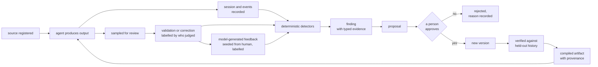

# The data flywheel

Last updated: 2026-07-21

This explains how an agent system gets better at its job over time, on purpose,
with people in control of every change.

It describes a design, not a finished product. Everything below is how we think
these systems should work; a section near the end says how much of it this
repository has actually built. Read that before assuming any of it is running.

It is written for someone who already uses an agent harness like Claude Code and
wants to know whether the pattern is worth copying. You do not need to know
anything about this codebase.

One note before you start. This project's names are a joke — archetypes borrowed
from Freud, an analysis step called the couch, maintenance passes called
dream-work. The names are tongue in cheek. The design underneath is not. This
document uses plain names throughout.

The six stages in the loop above: record what happened, find what repeats,
propose a change, have a person approve it, publish it as versioned knowledge,
and verify it actually helped. Each is explained below.

## What a data flywheel actually means

The phrase gets used loosely, so here is the whole of it: the output of using the
system becomes the input that improves the system, and each turn starts from a
better position than the last one.

That is it. No more than that.

The word matters because of what it rules out. A system where someone
occasionally notices a problem and edits a prompt is not a flywheel — the
improvement does not accumulate, and nobody can say later why the prompt says
what it says. A flywheel needs four things:

- the system records what it did, automatically
- something finds the patterns in that record
- changes are proposed from evidence, not from memory
- changes are versioned, so you can see what improved and roll back what did not

Add people approving each change and you have the loop in the diagram above.

## The problem this solves

Agents do not get better on their own. A harness gives you tool use, memory
inside a session, and subagents. It does not give you a way for a lesson learned
on Tuesday to still be in effect in March.

The usual answers decay in known ways. Fine-tuning is slow, expensive and opaque
about what changed. Prompt tweaks accumulate with no record of why.

The instructions-file answer fails in a more specific way than "it gets messy",
and the specifics are the reason for this design. Anthropic's own research on
agentic context engineering measured what happens when a model repeatedly
rewrites one evolving instructions document: rewrites preferentially drop
domain-specific detail, and repeated re-summarization compounds until knowledge
disappears in a jump. Their names for these are brevity bias and context
collapse. The fix they land on is to stop rewriting documents and start emitting
small, identified, individually-versioned entries merged by deterministic logic.

That is the bet here too. Rules, skills and validated knowledge live as versioned
rows, and compile into the files the agent reads. Changing behaviour means
changing a row, which means every change has an author, a date, an approval, and
the evidence behind it.

## What the loop runs on

Before the stages, the objects. Everything below is one of these.

A source is a registered piece of raw material — a contract, a policy page, a
support ticket, a table export. One row per source, carrying its location, its
type, and a hash of its content at the time it was registered. That hash is what
later tells you the source changed underneath you.

An output is one thing an agent produced from a source using a skill. One row per
output. It records which source, which skill version, and which session made it,
so any output can be traced to the exact instructions in force when it was
produced.

A validation or correction is one person's judgement about one output. One row
each. A validation says this was right; a correction says this specific field was
wrong and here is what it should have been. Both matter, and most systems only
collect the second.

A finding is one detected pattern, carrying the rows that evidence it. A proposal
is one suggested change to one knowledge unit, carrying the findings that justify
it. An approval turns a proposal into a new version.

Cold start is the case where none of this exists yet. You register your sources,
hand-author a first set of rules and skills, run the agent over the corpus, and
route every single output through human validation — because on day one nothing
derived is trustworthy. The flywheel needs a first turn, and that first turn is
almost entirely human.

## The six stages

### 1. Sense — record everything

Every agent session leaves a transcript. Every business system leaves events. All
of it lands in one warehouse.

The part that matters is how rows are identified. Keys are computed from stable
natural identifiers rather than handed out by a counter, so any worker can
compute a row's key without coordinating with anything, and re-ingesting
unchanged material writes zero rows by construction rather than by a
deduplication pass. That makes ingest safe to schedule and forget.

Two caveats worth stating plainly. Deterministic keys give you coordination-free
key computation, which is what makes this pattern port to distributed pipelines —
they do not by themselves give you multi-writer safety, which is a property of
the store you choose. And the guarantee should be measured rather than asserted:
every ingest run records rows read, written and skipped, so "re-ingest wrote
nothing" is a number you can look at.

### 2. Analyze — find what repeats

Deterministic detectors scan the warehouse for patterns worth acting on. An
extraction field corrected the same way twelve times. A source whose content hash
no longer matches what was registered. A step in a process that fails at an
elevated rate for one customer segment. In an agent context, the same tool
retried identically in a loop.

Deterministic first, inference last. Detectors written as queries are cheap,
repeatable, and give the same answer twice, so they run continuously without a
model in the hot path. A model is asked only for the judgements a query cannot
make.

The most important of those judgements is mechanism rather than symptom. Two
failures with identical surface outcomes can have entirely different causes, so a
finding should eventually record the terminal cause, the behaviour implicated,
and the abstract mechanism the evidence exposes — not just a count. Findings that
are diagnoses make proposals bounded; findings that are counters do not.

Findings also need a lifecycle. The same problem detected on ten consecutive runs
should be one open case with a recurrence count, not ten identical rows.
Otherwise the review queue fills with re-detections and people stop opening it.

### 3. Propose — turn a pattern into a suggested change

A finding with enough evidence becomes a written proposal: change this rule, add
this instruction, retire this skill. What counts as enough is a threshold that
lives as data per finding type, tunable per domain without a code change, rather
than a constant buried in a detector.

The proposal links to the exact findings and rows that justify it, and those
links carry a claim type, because a proposal's justification is really several
different kinds of claim: a numerical one (the detector counted this), a
reference one (the cited row exists and says what is claimed), a methodological
one (this is what the wording change does), and a conclusion (therefore the
pattern should shrink). Each is checkable in a different way, and a reviewer
handed one undifferentiated blob of evidence checks none of them.

That matters because of a documented failure. In a study of automated research
systems, every approach that did not enforce claim-by-claim grounding produced
surface-plausible output that hid broken evidence chains underneath. Prose
summaries of evidence are exactly the thing not to trust — including prose
summaries written by the proposing model.

### 4. Approve — a person decides

Nothing reaches the agent's context without someone saying yes.

The argument for this is specific rather than general. The fully-automated
version of this loop already exists in the literature, and its documented
weakness is precisely the missing gate: a noisy automated curator silently
pollutes the knowledge base and nothing catches it. Reported failures in
self-editing systems include reward hacking, where the system learns to game its
own scoring, and non-local damage, where an edit to a shared component breaks
things far from where the edit happened. The human approval step is the direct
fix for a named failure, not caution for its own sake.

The gate belongs in the tools rather than in a policy document. Tools an agent
can call should only ever create drafts, drafts should never compile, and the
approval action should always surface a prompt to the person running the session.

Being honest about the limit of that: a gate implemented in one tool surface is
only as strong as the other surfaces beside it. A command line, a database
client, or a permission allowlist that quietly grows can each route around it.
Anything with write access is part of the gate's threat model, and a design that
only hardens the agent-facing tool has moved the problem rather than solved it.

Automation here is aimed at reducing how much a person must look at, never at
reducing how carefully they look. Those are different goals and only one of them
is safe. Deduplicating recurring findings into single cases, batching related
proposals, and routing by risk all reduce volume. Speeding up the review itself
mostly means making it shallower.

### 5. Publish — compile knowledge into what the agent loads

An approved change creates a new version. Old versions are not overwritten; they
are closed with a date, so "what did we believe in March" stays a plain query and
rolling back is selecting an earlier row rather than reconstructing history.

Current, active knowledge then compiles into the artifacts the agent actually
loads. Those artifacts are build output: do-not-edit headers, a line naming the
row they came from, and a footer naming the proposal and evidence behind them.
The knowledge base is the source of truth; the files are a cache of it.

Because they are a cache, something has to check they still match. A drift check
that compares compiled output against current rows belongs in continuous
integration, not in trust — otherwise the first person who hand-edits a compiled
file has silently forked the system, and the next compile reverts their work with
no warning.

A privacy gate runs before anything is written, and it should be fail-closed:
output that would leak a credential, a home directory path, a customer
identifier, or anything else that should not leave the machine does not get
written, and the last good version stays in place.

The stronger version of this is to redact at ingest rather than at compile.
Blocking leaks on the way out while accepting a dirty warehouse means the
warehouse itself becomes the exposure, and retention policy, deletion requests
and audit all land on it.

### 6. Verify — prove it actually helped

Before a new version ships, run it against work that has already been reviewed
and marked correct.

The test is two-sided. The new version has to fix the thing it was written to fix,
and it has to break nothing else. Passing one and failing the other is a fail.
When it fails, the last good version keeps serving.

The detail that makes this data-driven rather than a test suite: the "did it fix
the thing" set is derived from the proposal's own evidence chain — the findings
it cited, the sessions those findings referenced, the validated outputs from
those sessions — and an empty set fails closed rather than passing vacuously. The
provenance chain is not decoration; it is what makes verification computable.

Two costs to be honest about. Verification is model inference per candidate per
held-out item, so it grows with both proposal volume and holdout size. And a gate
that becomes slow is a gate people route around, which is its own failure. Making
verification rigorous and making it fast are in genuine tension, and any real
deployment has to pick a point on that line deliberately.

## Where the signal comes from

This is the part that decides whether the loop compounds, and it is the part most
implementations get wrong.

### Feedback is a labelled overlay on immutable data

Records are never edited in place. An output stays exactly as produced; feedback
about it is a separate row pointing at it. That keeps the original recoverable,
lets several people disagree about the same output without overwriting each
other, and makes "what did we think about this, and when" answerable.

Every piece of feedback carries who or what produced it — a named person, a
model, a usage signal, a downstream system. Not just human or machine, but
specific enough to filter on later. This label is what makes everything else in
this section possible.

### Feedback arrives at two grains

Field-level corrections say a specific output was wrong. Each type points at a
different defect in the instructions:

| Correction type | What it means | What it tells you |
|---|---|---|
| wrong value | the value is incorrect | the instructions are ambiguous |
| missing field | something was not extracted | the skill needs to ask for more |
| field mapping | right value, wrong place | the output shape is confusing |
| false positive | the agent invented something | the skill needs a constraint |

Unit-level feedback says a piece of knowledge itself is wrong — outdated,
unclear, or in fact the thing that solved the problem. This is what lets people
who read the knowledge base, not just people who review agent output, turn the
same flywheel. Both grains land in the same store, feed the same detectors, and
become the same kind of proposal.

### Model-generated feedback amplifies; it does not substitute

Human review does not scale to the volume these systems produce, so the obvious
move is to have a model generate feedback, using human-reviewed examples as its
seed. Done carefully this works. Done carelessly it is the most efficient way to
make a system confidently wrong that we know of.

The precondition is diversity of the seed, not size of it. A model given
human feedback that covers a wide range of inputs can extend it sensibly. A model
given feedback concentrated in one slice has two ways to fail on everything else,
and both are bad:

- it falls back on its own prior knowledge, which is not your organisation's
  judgement and cannot be audited against anything
- it applies feedback from an unrelated slice, producing labels that are
  confident, consistent, and about the wrong thing

Neither failure looks like a failure. Volume goes up, coverage appears solved,
and the errors are systematic rather than noisy — which means they compound
instead of averaging out.

So the controls are structural rather than advisory. Keep the human-versus-model
label on every row so model-derived feedback can be excluded from any measurement
that matters. Hold a genuinely human-only slice that no model process has touched
and measure against it separately. Keep a floor on the ratio of human judgements
rather than letting model volume float free. And when the two disagree, believe
the humans and go find out why.

### Sampling is a product surface, not a background job

If diverse human feedback is the precondition, then collecting it is a design
problem, not something that happens if people are diligent. Left alone, review
concentrates on whatever is quickest to check, which is exactly the material the
system already handles well.

So something has to actively choose what a person is asked to look at: spread
across domains, customers, task types and difficulty, weighted toward the slices
where coverage is thin. That is a sampler with a user interface.

The agreeable part is that the harness can be that interface. An agent can pull a
stratified sample, present each item with the source beside it, capture the
judgement, and write it back labelled — which makes the review surface one more
thing built from the same data rather than a separate application to maintain.

The loop, end to end:

## The grounding layer

The governed data that the loop produces and consumes is the grounding layer: the
layer between raw sources and the agent, with three faces.

Constraints on one end — rules, activation conditions, policies. Grounding data
in the middle — validated knowledge, its evidence, its provenance. Verifiers and
feedback on the other — eval gates, holdout results, corrections, usage signals.

It is a layer rather than a store because it has two physical forms. The
warehouse is its governed source of truth; the compiled files are its
agent-facing form. That single sentence is what connects everything in this
document: the storage split below is not a separate design choice, it is what
this layer looks like from underneath.

## Three design choices

### Skills are looked up, not switched on

A context window is attention, not memory. Filling it with material that does not
apply to the current task makes answers worse, not just more expensive.

So knowledge splits by how often it applies. A small always-loaded layer holds the
constraints that apply to everything. A middle layer holds the instructions for a
particular kind of job, loaded when it matches. A large bottom layer holds
reference material, opened by name when the work needs it.

Which means the routing decision is the product. At small scale a harness picks
among a handful of skills by exact match. At real scale, consumers describe needs
in fuzzy language and the system ranks thousands of knowledge units. The evidence
points at lexical search plus ranking on structured metadata — status, validation
state, eval score, usage signal — as the core, with embeddings as an optional
last resort for large fuzzy corpora rather than the first thing reached for.

There is a stronger version of this idea that is easy to miss. If behaviour is
data, then the selection logic is behaviour too. A skill should carry not only its
content but the operators that decide when it applies and how it composes — and
those should be versioned and evolvable through the same proposal flow as the
content. Otherwise you have made the knowledge data-driven and left the routing
hardcoded, which is where the interesting decisions actually live.

### Files and a warehouse do different jobs

There is a long-running argument about whether agent knowledge belongs in files or
in a database. It resolves by splitting on the kind of data, and then adding a
third thing most summaries drop.

Files win for anything the agent reads as instructions. Models are pretrained on
file and shell idioms, so navigating files is a foundation skill rather than a
system you have to build — and one that improves on its own as base models
improve. Anthropic built vector search into early Claude Code and then removed
it, reporting that agentic search worked better and avoided problems with
staleness, privacy and reliability. Cursor is the notable counterexample, keeping
embeddings for whole-codebase recall on large unfamiliar repositories, which is
the case where the tradeoff genuinely flips.

Warehouses win for anything you count, aggregate, or ask about over time. Grep
cannot tell you whether the correction rate went down this quarter.

The third thing: the warehouse is also the catalog and governance layer over the
files. It holds what they were compiled from, when, on whose approval, and
whether they still match. This is the same conclusion the lakehouse world reached
independently — files hold content, a catalog holds schemas, snapshots and
statistics, and the database's job is governance rather than primary storage.
Drop this row and the split reads as two peers, when it is actually a hierarchy.

### Behaviour lives in data, so it survives the tools

Keeping this as governed data rather than as code in an orchestration framework is
a bet that frameworks churn faster than schemas do. The same rows can feed one
harness today and another in two years.

The clearest test of whether a system really means it is what happens when you
need a new category. Adding a new kind of finding, a new event type, or a new
feedback class should be inserting a row in a registry — no schema change, no
deployment, no code review. The taxonomy of problems in any domain is discovered
by running the loop, not designed in advance, so the vocabularies have to be open.

The contrast is just as important. Some vocabularies should stay closed. The set
of things a proposal is allowed to modify is a closed list on purpose, because
adding a member means the loop has learned to change a new kind of thing, and that
is a deliberate engineering decision rather than a row somebody inserted. Knowing
which vocabularies are open and which are closed is most of this design.

## Provenance is a chain, not a footer

The doc has claimed several times that you can always ask why a piece of knowledge
says what it says. Here is what that actually means.

Every compiled artifact names the row it came from. Every row names the proposal
that created it. Every proposal names the findings that justified it, each with a
claim type. Every finding names the sessions and records that evidence it. And
every one of those is a relationship between rows, not a comment in a file — so
the question is a query, not an archaeology exercise:

> This rule says "escalate any contract with a non-standard indemnity clause."
> Which proposal created this version, who approved it and when, which findings
> did they cite, how many cases did each finding aggregate, and are those cases
> still open?

Every hop in that sentence is a join. The footer in the compiled file is a
convenience rendering of the first two hops, for a reader who has the file and
not the database.

One consequence worth designing for from the start: knowledge and telemetry have
different lifecycles. Sessions and events are high volume, sensitive, and
retention-bound. Feedback, proposals and approval history are small, precious,
and not re-derivable from anything — nobody can reconstruct a human judgement
that was deleted. If the evidence a rule cites lives on a deletion clock, the
provenance chain will one day point at rows that no longer exist, and it will look
intact right up until someone follows it.

## How you know it is turning and not just spinning

A flywheel that runs without compounding is worse than none, because it looks
like progress. Four measures separate them:

- correction rate per version — are people correcting the new version less than
  the old one
- recurrence after a change — did the pattern the rule targeted actually shrink
- time to validation — how long output waits before anyone checks it
- rejection rate — a rate near zero means the gate is not really being used

These are queries rather than a separate reporting system, and one modelling
decision is what makes them cheap: facts carry the dimension attributes they were
produced under, stamped at insert time. An output records the skill version that
made it, so accuracy by version is a filter rather than a reconstruction. Without
that, every one of these questions becomes an expensive historical join, and in
practice nobody asks them.

Two disciplines about measurement itself. Denominate verification windows in
volume rather than in elapsed days, because days tell you nothing about
statistical power. And pair every detector with an outcome measure that is harder
to game: a rule that stops the agent retrying will drive retry findings to zero
whether the task now succeeds or the agent simply gives up.

## How this goes wrong

These loops fail from lack of signal far more often than from broken mechanics.
The mechanical half is the visible engineering problem. The signal is what decides
whether anything compounds — and building the mechanics while neglecting the
signal is the single most common way these systems plateau.

The five that cause most of it:

| Failure | What you see | First thing to check |
|---|---|---|
| Nobody corrects anything | detectors fire, no corrections arrive | corrections per week against volume per week |
| Signal from one corner | one slice improves, others quietly rot | corrections grouped by domain, customer, task type |
| Model feedback from a thin seed | volume rises, quality does not | how the seed was sampled, and against what |
| Knowledge goes stale | answers that were right last year | source hashes, age of each knowledge unit |
| Approval becomes a rubber stamp | everything gets approved | rejection rate, and how many distinct approvers |

Three are counterintuitive enough to name here.

Success starves the loop. The fuel is errors, so removing errors removes fuel.
Improvement flattens and correction volume falls, and it is genuinely ambiguous
whether the system got good or people stopped looking.

One reviewer becomes the policy. A single approver's preferences compound into
the knowledge base, and there is no disagreement signal to detect it with. The
check is structural rather than statistical: count distinct approvers. If it is
one, you have this by construction whether or not it has bitten yet.

The knowledge base only ever grows. Every finding adds a rule and nothing ever
retires one, until the always-loaded layer is enormous and the instructions have
become a document nobody reads — the exact failure this design exists to avoid.
Retirement has to be a first-class change, not an afterthought.

[How data flywheels fail](flywheel-failure-modes.md) covers eighteen in detail —
what each looks like, why it happens, and how to catch it.

## Where the reference implementation actually is

This repository is a working reference implementation of the pattern above, at
single-operator scale. It is a research repo, not a product.

| Stage | State |
|---|---|
| Sense | working, for agent transcripts and generic event streams |
| Analyze | detection works; findings have no lifecycle yet, so recurrence is not tracked |
| Propose | proposals work and carry evidence; claim types on evidence are not built |
| Approve | working, including the draft-only tool gate |
| Publish | compiling and provenance footers work; scope-organised output and the drift check are not built |
| Verify | not built |

Also unbuilt: ranked retrieval, ingest-time redaction, identity and permissions,
unit-level feedback, model-generated feedback with the labelling and sampling
controls described above, and consolidation passes.

The honest summary is that the mechanical half of the loop exists and the
signal-quality half mostly does not. That is the normal order in which these get
built, and it is also why so many plateau.

The loop has run end to end once, in July 2026: detectors found patterns, a model
judged them, three evidence-linked proposals were written, the owner approved
them, and they compiled with provenance footers. Three proposals and three
approvals is also, by the rejection-rate measure above, indistinguishable from a
rubber stamp — n of three supports nothing in either direction, and it is listed
here as an existence proof that the machinery connects, not as evidence that the
governance works.

The one measurement attempted was underpowered and is not evidence of anything:
identical-retry sessions went from 1.5 percent before a rule to zero out of
sixty-four sessions after, where the expected count at that base rate is about
one.

## What would show this is wrong

A design that cannot be wrong is a manifesto. Three things would count as
evidence against this one.

If correction rates per version do not fall as versions accumulate, over a sample
large enough to detect the effect, the loop is not compounding and the governance
overhead is not buying anything.

If base model improvement dominates. This is the strongest competing explanation
and it deserves stating plainly: if models improve faster than an accumulated rule
corpus adds value, the grounding layer is at best neutral and at worst a drag,
with stale rules constraining a more capable model. The test is to hold the corpus
fixed across a model upgrade and then remove rules to see whether anything gets
worse. Nobody has run it.

If the review burden exceeds the measured quality gain. There is a volume at which
human approval stops being affordable, and no amount of triage automation removes
it — it only moves where the judgement happens. If that point arrives before the
loop demonstrably compounds, the pattern does not work at that scale.

## Sources

Claims above are drawn from the [research review](research-agent-data-representation.md),
which carries full citations and its own sourcing caveats. Two worth repeating
here: several of the papers cited were reachable only as abstracts and author
summaries rather than full texts, so their reported results are author-claimed
and not independently verified. Specifically, the self-editing failure modes in
stage 4 and the evidence-chain study in stage 3 both rest on that weaker footing.
The Anthropic vector-search decision is a directly attributed practice report, not
a paper result.

## Learn more

Start here if you want to run it:

- [Cold-start tutorial](tutorial-cold-start.md) — day one, from an empty database
  to the first turn of the loop
- [Extraction tutorial](tutorial-arxiv-extraction.md) — the full pipeline against
  a real document
- [Feedback tutorial](tutorial-flywheel.md) — reviewing output and recording
  corrections, then the governed path: detectors, proposal, approval, compile

Go deeper on the design:

- [How data flywheels fail](flywheel-failure-modes.md) — the failure modes above
  in full, with what this repo defends against today
- [Roadmap](../ROADMAP.md) — what scales, what breaks, and in what order
- [Implementation plan](implementation-plan.md) — milestones and definitions of done
- [Research review](research-agent-data-representation.md) — how this design holds
  up against the 2026 literature and production practice
- [Progressive disclosure](../skill/reference/retrieval-thesis.md) — why skills are
  retrieval rather than configuration
- [Schema reference](../skill/reference/schema.md) — every table and column
