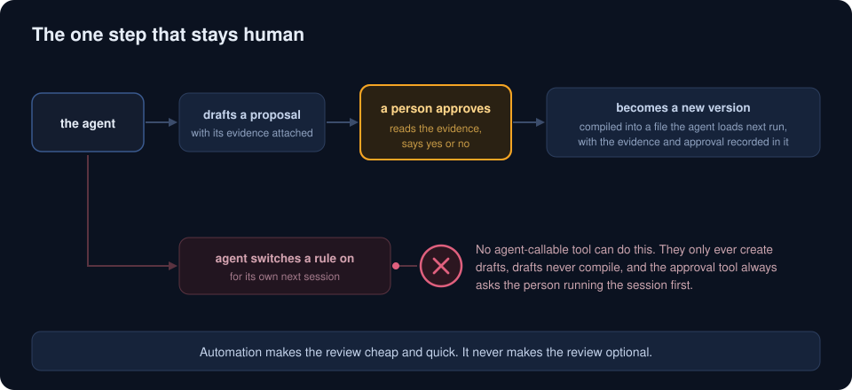
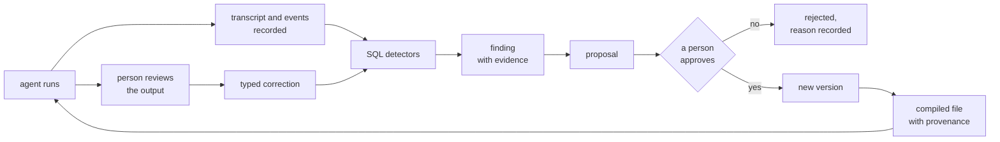
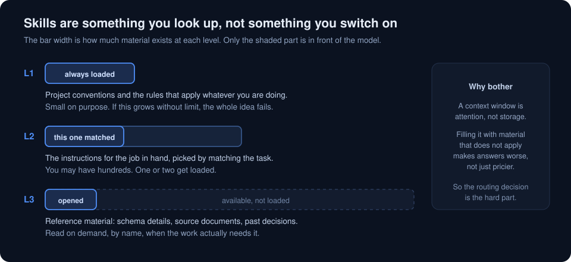
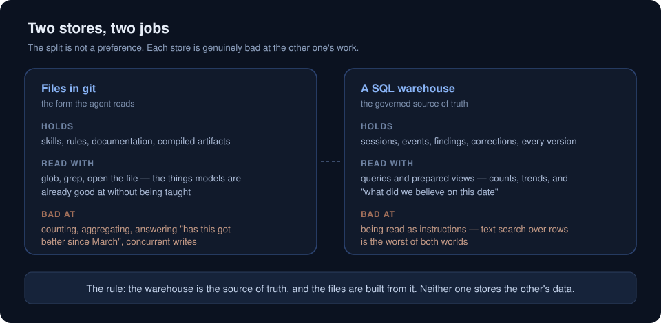
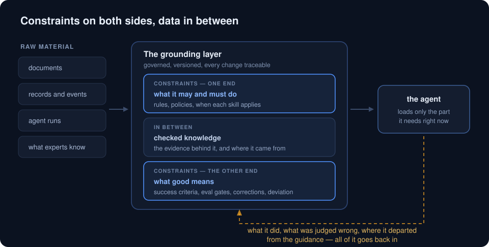

# The data flywheel

Last updated: 2026-07-21

This explains how an agent system gets better at its job over time, on purpose,
with a person in control of every change.

It is written for someone who already uses an agent harness like Claude Code and
wants to know what this repo is claiming and whether the idea is worth copying.
You do not need to know anything about this codebase.

One note before you start. The project's names are a joke — archetypes borrowed
from Freud, an analysis step called the couch, maintenance passes called
dream-work. The names are tongue in cheek. The design underneath is not. This
document uses plain names throughout and puts the repo's own words in brackets
where you would need them to find something in the code.

## What a data flywheel actually means

The phrase gets used loosely, so here is the whole of it: the output of using the
system becomes the input that improves the system, and each turn starts from a
better position than the last one.

That is it. No more than that.

The word matters because of what it rules out. A system where someone
occasionally notices a problem and edits a prompt is not a flywheel — the
improvement does not accumulate, and nobody can say later why the prompt says
what it says. A flywheel needs four things:

- the system records what it did, automatically
- something finds the patterns in that record
- changes are proposed from evidence, not from memory
- changes are versioned, so you can see what improved and roll back what did not

Add a person approving each change and you have the loop in the diagram above.

## The problem this solves

Agents do not get better on their own. A harness gives you tool use, memory
inside a session, and subagents. It does not give you a way for lesson learned on
Tuesday to still be in effect in March.

The usual answers all decay. Instructions files grow until nobody trusts them.
Prompt tweaks accumulate with no record of why. Fine-tuning is slow, expensive,
and opaque about what changed.

The answer here is different: treat the agent's behavior as data. Rules, skills
and knowledge live in a database as versioned rows, and compile into the files
the agent reads. Changing behavior means changing a row, which means every
change has an author, a date, an approval, and the evidence behind it.

## The six stages

Each stage below says what happens, why it exists, and whether it is built. The
status markers are honest: the design is deliberately ahead of the code.

### 1. Sense — record everything

Every agent session leaves a transcript. Every system leaves events. All of it is
ingested into one warehouse.

The part that matters: row identifiers are derived from the content itself, not
handed out by a counter. Ingest the same transcript twice and the second run
writes zero rows, because it computes the same identifiers. That makes re-running
ingest safe, which in turn makes it something you can schedule and forget.

Status: shipped. Agent transcripts and generic event streams both work, through
the same path.

### 2. Analyze — find what repeats

Plain SQL detectors scan the warehouse for patterns worth acting on: the same
tool being retried in a loop, permission prompts blocking the same operation
repeatedly, a source file that has changed since anyone read it.

The rule here is deterministic first, inference last. Detectors are SQL, so they
are cheap, repeatable, and produce the same answer twice. A model is only asked
for the judgment calls SQL cannot make — for example, working out the mechanism
behind a pattern rather than just its symptom.

Detectors produce findings, and a finding carries the rows that evidence it.

Status: shipped for detection. Not yet built: giving findings a lifecycle, so
that the same problem detected on ten consecutive runs is one open case rather
than ten identical rows. That is the difference between a review queue you can
work through and one you abandon.

### 3. Propose — turn a pattern into a suggested change

A finding with enough weight behind it becomes a written proposal: change this
rule, add this instruction, retire this skill. The proposal links to the exact
findings and rows that justify it.

That linking is the point. A reviewer should be able to check the claim rather
than trust the summary. Research on evidence chains in agent systems found that
plausible-sounding summaries routinely hide broken reasoning underneath, so the
evidence links are typed by what kind of claim they support — a count, a change
in wording, a conclusion drawn from both.

Status: shipped. Typed evidence links are specified but not yet built.

### 4. Approve — a person decides

Nothing reaches the agent's context without someone saying yes.

This is not caution for its own sake. An agent with the ability to write its own
instructions can write instructions that load into its own next session. The
published work on fully automated self-improvement reports exactly the failures
you would expect from that: systems that learn to game their own scoring, and
edits to shared components that break things far from where the edit happened.

So the gate is built into the tools rather than into a policy document. The tools
an agent can call only ever create drafts. Drafts do not compile, so they never
load. The approval step always asks the person running the session, and that
permission prompt is the approval — there is no way to make it silent.

The command line has no such restriction, because a person is typing it. The gate
is aimed at agent-invoked tools specifically.

Automation is aimed at making the review quick, never at removing it.

Status: shipped, including the tool-level gate.

### 5. Publish — compile the knowledge into files

An approved change creates a new version of the rule or skill. Old versions are
not overwritten; they are closed off with a date, so "what did we believe in
March" stays a plain query.

Current, active knowledge then compiles into markdown files — the ones the agent
actually loads. Each file carries a do-not-edit header and a footer naming the
proposal, the approval and the evidence behind it. The files are build output.
The database is the truth.

A check runs before anything is written: if compiled output would contain a
secret, a home directory path, or anything else that should not leave the
machine, the compile fails and the previous good output stays in place.

Status: shipped. Not yet built: organizing compiled rules by scope so the
always-loaded set stays small as the rule count grows.

### 6. Verify — prove it actually helped

Before a new version ships, run it against work that has already been reviewed
and marked correct.

The test is two-sided. The new version has to fix the thing it was written to fix,
and it has to break nothing else. Passing one and failing the other is a fail.
When it fails, the last good version keeps serving.

Status: not built. This is the honest gap in the loop — today, whether a change
helped is judged by looking. Planned as milestone M13.

## Where human feedback fits

Human feedback enters at two different grains, and the difference matters.

Field-level corrections say a specific output was wrong:

| Correction type | What it means | What it tells you |
|---|---|---|
| `wrong_value` | the value is incorrect | the instructions are ambiguous |
| `missing_field` | something was not extracted | the skill needs to ask for more |
| `field_mapping` | right value, wrong place | the output shape is confusing |
| `false_positive` | the agent invented something | the skill needs a constraint |

Document-level feedback says a piece of knowledge itself is wrong: outdated,
unclear, or in fact the thing that solved the problem. This grain is designed but
not yet built, and it is what lets people who read the knowledge base — not just
people who review agent output — turn the same flywheel.

Both kinds land in the same warehouse, feed the same detectors, and become the
same kind of proposal. One loop, several sources of signal.

The flow, end to end:

## Three design choices that make it work

### Skills are looked up, not switched on

A context window is attention, not storage. Filling it with material that does
not apply to the current task makes answers worse, not just more expensive.

So knowledge is split by how often it applies. A small always-loaded layer holds
the conventions that apply to everything. A middle layer holds the instructions
for a particular kind of job, loaded when it matches. A large bottom layer holds
reference material, opened by name when the work needs it.

This is why the routing decision — which skill matches this task — turns out to
be the hard problem at any real scale, and why ranked search over knowledge is a
planned piece of work rather than an optimization.

### Files and a database each do the job they are good at

There is a long-running argument about whether agent knowledge belongs in files
or in a database. It resolves by splitting on the kind of data, not by picking a
winner.

Files win for anything the agent reads as instructions. Models are already good
at globbing, grepping and opening files — no retrieval system to build, and the
skill improves as base models improve. Anthropic built vector search into early
Claude Code and then removed it, because straightforward searching worked better.

Databases win for anything you need to count, aggregate, or ask about over time.
Grep cannot tell you whether the retry rate went down this month.

Put artifact-shaped data in rows and you get text search over columns, which is
the worst of both. Put event-shaped data in files and you cannot count it. The
warehouse governs; the files are compiled from it.

### Behaviour lives in data, so it survives the tools

The layer between your raw data and the agent has three faces: constraints
telling the agent what it must and must not do, checked knowledge with the
evidence behind it, and the gates and corrections that decide what gets in.

This repo calls that the grounding layer. Keeping it as governed data, rather
than as code in an orchestration framework, is a bet that frameworks churn faster
than schemas do. The same rows can feed Claude Code today and something else in
two years.

It also means this project sits inside the harness rather than wrapping it. The
harness decomposes tasks, routes work, and runs anything needing a model. This
side supplies data and gates, and never calls a model itself.

## How you know it is turning and not just spinning

A flywheel that runs but does not compound is worse than no flywheel, because it
looks like progress. The measures that tell them apart:

- correction rate per version — are people correcting the new version less than
  the old one
- recurrence after a change — did the pattern the rule targeted actually shrink
- time to validation — how long output waits before someone checks it
- proposals rejected — a rate near zero means the gate is not really being used

These are queries against data the loop already produces, not a separate
reporting system. The views that answer them are planned alongside the
verification gate.

One measurement lesson already learned here: the first rule this system shipped
was checked too early to prove anything. Identical-retry sessions went from 1.5%
before to 0 out of 64 after — directionally right, statistically meaningless.
Measure in sessions, not days.

## Where this repo actually is

| Stage | Status | Notes |
|---|---|---|
| Sense | shipped | transcripts and generic event streams |
| Analyze | shipped, partly | detection works; finding lifecycle is planned (M11) |
| Propose | shipped, partly | proposals work; typed evidence links planned (M12/M13) |
| Approve | shipped | including the tool-level gate against self-modification |
| Publish | shipped, partly | compiling works; scoped output planned (M10) |
| Verify | not built | planned (M13) |

Also planned: ranked retrieval over knowledge (M8), redaction as data is
ingested rather than as it is compiled (M6), identity and permissions (M7), a
serving layer so people can read the knowledge base directly (M14), and periodic
consolidation passes so the store reorganises rather than only accumulating
(M15).

The loop has run end to end once for real, in July 2026: detectors found
patterns, a model judged them, three evidence-linked proposals were written, the
owner approved them, and they compiled with provenance footers attached.

## Learn more

Start here if you want to run it:

- [Cold-start tutorial](tutorial-cold-start.md) — day one, from an empty database
  to the first turn of the loop
- [Extraction tutorial](tutorial-arxiv-extraction.md) — the full pipeline against
  a real document, with the reasoning behind each step
- [Feedback tutorial](tutorial-flywheel.md) — reviewing output and recording
  corrections, then the governed path in full: run the detectors, draft a
  proposal from a finding, approve it, and compile it with its provenance
  attached. Sections 9 to 16 are stages 2 through 5 above, as commands

Go deeper on the design:

- [Roadmap](../ROADMAP.md) — what scales, what breaks, and in what order to fix it
- [Implementation plan](implementation-plan.md) — the milestones referenced above,
  with schema changes and definitions of done
- [Research review](research-agent-data-representation.md) — how this design holds
  up against the 2026 literature and production practice, and the six places the
  research changed the plan
- [Progressive disclosure](../skill/reference/retrieval-thesis.md) — why skills
  are retrieval rather than configuration
- [Schema reference](../skill/reference/schema.md) — every table and column

Every stage marked shipped above can be run end to end from the tutorials. The
stages marked planned cannot, by definition — verification in particular has no
commands behind it yet.
