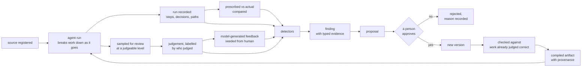

# The data flywheel

Last updated: 2026-07-21

This is the source of truth for how we think agent systems should work. It is
detailed on purpose. A shorter, plainer explainer is derived from it.

It describes a design, not a finished product. A section near the end says how
much of it this repository has built. Read that before assuming any of it runs.

Most of what follows is data engineering. Ingestion is ingestion, pipelines are
pipelines, and transforming data according to business rules, feedback and
context is what the field has always done. What is different is that the rules
are dynamic, and that agent harnesses are what make them so. We use ordinary
names for the ordinary parts and coin a term only where something has no name.

One note on this project's own naming. Archetypes borrowed from Freud, an
analysis step called the couch, maintenance passes called dream-work. Those
names are a joke. The design underneath is not.

Six stages: record what happened, find what repeats, propose a change, have a
person approve it, compile it into what the agent loads, and check it helped.

## What a data flywheel actually means

The output of using the system becomes the input that improves the system, and
each turn starts from a better position than the last.

That is the whole of it. The word matters because of what it rules out. Someone
occasionally noticing a problem and editing a prompt is not a flywheel — the
improvement does not accumulate, and nobody can say later why the prompt says
what it says. A flywheel needs the system to record what it did automatically,
something to find the patterns in that record, changes proposed from evidence
rather than memory, and changes versioned so you can see what improved and undo
what did not.

Add people governing each change and you have the loop above.

## The problem this solves

Agents do not get better on their own. A harness gives you tool use, memory
inside a session, and subagents. It does not give you a way for a lesson learned
on Tuesday to still be in effect in March.

The deeper problem is maintenance, and it is worth being blunt about it because
it is the actual reason this design exists.

Every organisation that has bought a data catalog knows the failure. The catalog
is accurate at onboarding. Within a quarter the pipelines have changed, the
definitions have drifted, and a rule somebody agreed in a meeting has quietly
replaced the one written down. Nobody updates it, because updating it is
unglamorous work with no owner and no deadline. Eventually it describes a
company that no longer exists, people stop trusting it, and then stop opening
it.

Most agent skills will rot the same way and for the same reason — not all of
them, but most. Businesses change, rules evolve, and new data changes what the
rules should be. Human maintenance of knowledge does not fail because people are
careless. It fails structurally, in every organisation that has tried it, which
is a strong enough pattern to design around rather than hope past.

So the question is not how to write good instructions. It is who keeps them
current. This design answers: the system does, from evidence, with people
governing what changes rather than authoring it by hand.

The instructions-file version of this fails in a specific, measured way, and the
specifics are why knowledge lives in rows here. Research on agentic context
engineering measured what happens when a model repeatedly rewrites one evolving
instructions document: rewrites preferentially drop domain-specific detail, and
repeated re-summarisation compounds until knowledge disappears in a jump. Their
names for these are brevity bias and context collapse. The fix is to stop
rewriting documents and start emitting small, identified, individually versioned
entries merged by deterministic logic.

## The grounding layer

Everything below builds one thing, so it is worth naming up front.

Between your raw material and the agent sits a layer of governed data. Not a
prompt, not a config file, and not a knowledge base in the usual sense — a layer
with three faces.

Constraints on one end, saying what the agent may and must do. Grounding data in
the middle: checked knowledge, the evidence behind it, and where it came from.
Verifiers and feedback on the other end, saying what good means and whether it
was achieved.

It is a layer rather than a store because it has two physical forms. A warehouse
holds the governed truth. Compiled files are what the agent actually reads. The
files are built from the warehouse the way a binary is built from source.

This is the one term in this document we had to invent, because nothing else
named it. Everything that follows is either what goes into this layer, how it
changes, or how you know whether it is helping.

## What the loop runs on

The data model, in ordinary warehouse terms. Dimensions describe things and
change slowly. Facts record what happened and are only ever appended to.

A source is a registered piece of raw material — a contract, a policy page, a
ticket, a table export — with its location, its type, and a hash of its content
at the time it was registered. That hash is what later tells you it changed
underneath you.

A skill is guidance for the agent. It gets its own section below.

A run is one execution, recorded at the lowest granularity available: the
messages, the tool calls, and the reasoning trail — decisions, paths taken,
paths discarded, dead ends, conclusions. Recorded by default rather than
switched on when someone suspects a problem, because you never suspect in time.

An output is one thing an agent produced, recording which source, which skill
version, and which run made it.

A judgement is one person's assessment of one output, at whatever level the work
was broken down to.

A finding is one detected pattern with the records that evidence it. A proposal
is one suggested change with the findings that justify it. An approval turns a
proposal into a new version.

Every fact carries the identifier of the ETL run that produced it, and every run
is a row in a load log recording what it read, wrote and skipped, when, and
whether it succeeded. That is what makes lineage total rather than aspirational:
any record ties back to the run that created it, and those ties aggregate.

### Versioned and immutable, wherever it lives

Records are never edited. Changes append. The previous version and the
difference between them are always recoverable, and every version ties to the
run that produced it and the evidence that justified it.

That holds regardless of where a thing is stored. Whether a given piece of
knowledge belongs in files, in a warehouse, or in both is a live question with
real tradeoffs, and the answer differs by what the thing is. Whether it is
versioned and immutable is not a live question. It is the floor.

### Cold start: when none of this exists yet

Every deployment begins with an empty warehouse and existing knowledge in the
wrong shape — in people's heads, in a wiki nobody trusts, in a stale catalog.
The loop needs a first turn and cannot derive one from nothing.

So day one is deliberately manual. Register the sources with a content hash so
staleness has a baseline to compare against. Hand-author the first rules, the
first skills and the first breakdown of the work, marked as human-authored
rather than derived. Run the agent over the seed material. Then put every single
output in front of a person, because nothing derived is trustworthy yet and the
first turn's job is to produce a reference set rather than to save anyone time.

That is the most expensive turn and it never repeats. The failure to avoid is
treating cold-start output as truth because it came out of the system. It is the
one point where the system has no grounds for anything it says.

## Where the signal comes from

This section is long because it is the part that decides whether any of it
works. The mechanics in the next section are the visible engineering problem.
Signal quality is what determines whether the loop compounds or just turns.

### Constraints on both sides

An agent needs constraints in two directions, and most systems build only one.

Left-hand constraints say what the agent may and must do. Rules, policies, when
a particular piece of guidance applies. This is the side everybody builds,
because it is the side that feels like prompting.

Right-hand constraints define what good means. Success criteria for a task, a
step, an outcome. Without them an agent can be given excellent instructions and
still have no way to be told whether it succeeded — and neither do you. This is
the side that gets deferred, and deferring it is why so many of these systems
never demonstrably improve.

Grounding data sits between the two. Both sets of constraints are versioned data
and both evolve through the same loop as everything else.

### People can only judge what they can evaluate

Asking whether a business outcome was good produces a verdict with nowhere to
go. You learn it was bad, not where it went wrong or why. Judging outcomes alone
is close to useless for improvement, however satisfying it is to report.

So the work is broken down as far as it goes, and judgement is captured wherever
a person can look at one thing and answer confidently. Those judgements then
aggregate up to whatever level the business cares about. Interpretability
comes from the breakdown, not from the judgement.

Two different depths are in play and conflating them causes trouble. Breaking
down and recording go all the way to the bottom, because you cannot aggregate
detail you did not keep, and because the level that turns out to matter is
rarely the one you would have guessed. Where a person is asked to look is
separate and higher: it is set by what a business user can meaningfully judge.
Ask too coarse and the judgement is unactionable. Ask too fine and you are
asking someone to review mechanics they have no opinion about.

So capture depth is not a dial to tune. It goes to the bottom. Only the asking
is tuned.

Once enough human judgements exist at a given level, they become the reference
that lets a model make the same judgements at that level. That is the only
version of automated evaluation grounded in anything, and it inherits every
diversity requirement described below.

### The breakdown happens during the run

It is not an artifact somebody authors in advance. It is the shape of the work,
and it emerges as the agent goes.

A trivial request has no breakdown, because there is nothing to break down.
Forcing structure onto it would be invention. A business outcome splits into
tasks, which may spawn subagents, which split again. Depth varies by nature —
some branches go four levels and their siblings go none.

The agent breaks work down as it goes, leaning on skills, context and data to
navigate, the same way a person does. Recording that as it happens is what
produces interpretability: not only what the agent did, but why it chose this
path, what it considered and discarded, and where it changed approach. You
cannot reconstruct that afterwards from an outcome.

Each run's breakdown is a fact, recorded as it happened. Across many runs a
pattern appears on top of those facts: work of this shape reliably splits these
ways, in roughly this order, failing at these points. That pattern is derived
rather than observed, and worth keeping separate from the runs it came from — a
single run is raw and partly shaped by harness mechanics rather than by the
task, so no one run should be mistaken for the general case.

Once established, the pattern becomes guidance for future runs, which makes it a
high-level skill. So there is no separate catalog of breakdowns for anyone to
maintain, which matters, because an authored one would rot exactly like the data
catalog above.

### Feedback is a labelled overlay on immutable records

An output stays as produced. Feedback about it is a separate record pointing at
it. The original stays recoverable, several people can disagree about the same
output without overwriting each other, and what we thought about this and when
stays answerable.

Every piece of feedback carries what produced it. Human or model-derived is the
floor and it is what everything below depends on. More granular origin — a named
person, a specific model, a usage signal, a downstream system — is the direction
to grow in, because filtering years later is easier the more specific the label
was at the time.

Feedback arrives at more than one level. Field-level corrections say a specific
output was wrong, and each kind points at a different defect in the guidance:

| Correction | What it means | What it tells you |
|---|---|---|
| wrong value | the value is incorrect | the instructions are ambiguous |
| missing field | something was not extracted | the guidance needs to ask for more |
| field mapping | right value, wrong place | the output shape is confusing |
| false positive | the agent invented something | the guidance needs a constraint |

Unit-level feedback says a piece of knowledge itself is wrong — outdated,
unclear, or in fact the thing that solved the problem. That is what lets people
who read the knowledge base, not only people reviewing agent output, turn the
same loop.

### Model-generated feedback amplifies; it does not substitute

Human review does not scale to the volume these systems produce, so the obvious
move is to have a model generate feedback from a human-reviewed seed. Done
carefully this works. Done carelessly it is the most efficient way to make a
system confidently wrong that we know of.

The precondition is diversity of the seed, not size of it. A model given human
judgements spanning a wide range of inputs can extend them sensibly. A model
given judgements concentrated in one slice has two ways to fail on everything
else:

- it falls back on its own prior knowledge, which is not this organisation's
  judgement, was reviewed by nobody, and cannot be audited against anything
- it stretches the feedback it does have onto material that feedback was never
  about, producing labels that are consistent, plausible and wrong

Neither looks like failure. Volume rises, coverage appears solved, and the
errors are systematic rather than random — so they compound instead of
averaging out.

The controls are therefore structural. Keep the origin label on every record so
model-derived feedback can be excluded from any measurement that matters. Hold
back a slice judged only by people, which no model process has touched, and
measure against it separately. Keep a floor on the proportion of human
judgements rather than letting model volume float free. When the two disagree,
believe the people and find out why.

### Sampling is a product surface

If seed diversity is the precondition, collecting a diverse seed is a design
problem rather than a matter of diligence. Left alone, review concentrates on
whatever is quickest to check, which is exactly the material the system already
handles well.

So something has to actively choose what a person is asked to look at, spread
deliberately across domains, customers, task types and difficulty, and across
the levels the work broke into, weighted toward wherever coverage is thin.

The harness can be that interface. An agent pulls the spread, presents each item
beside its source at a level a person can judge, captures the judgement, and
writes it back labelled — making the review surface one more thing built from
the same data rather than an application to maintain.

### Deviation is signal in both directions

If the prescribed process is recorded and the actual process is recorded, the
gap between them is information. Comparing them is conformance checking, and the
broader practice of reconstructing a real process from its event log and
comparing it against the intended one is process mining. Neither idea is new
here.

Deviation runs two ways, and most systems look for only one.

An agent departs from the guidance and the result is worse. The guidance was
right, and either the agent went wrong or the guidance was not explicit enough
to follow.

An agent departs from the guidance and gets there faster with the same or better
result. That is not a defect. It is a process improvement the system discovered,
and the proposal it should generate is to update the guidance to match what
actually works.

The second case inverts what the loop is for. It is not only people writing
rules and the system catching the agent failing to follow them. It is also the
system catching the rules being wrong, with the agent as the thing that found
out.

Two conditions make this safe, and without them it is dangerous.

It requires measurable outcomes at the level the deviation happened. Otherwise
you cannot distinguish a genuine shortcut from a corner cut, and you will
promote the second, because in the short run they look identical.

And it requires enough declared structure in the guidance to depart from. Prose
saying "handle the escalation appropriately" cannot be deviated from measurably.
Something declaring expected steps, order or checkpoints can. That argues for
structure at the level where sequence is being prescribed, and plain prose
further down, where nothing is being sequenced.

There is a failure inside this worth naming here rather than only in the
companion document. Some steps exist to prevent something rare. Skipping them
looks strictly better every time until the rare thing happens. A system that
promotes deviations on observed outcomes will systematically strip out exactly
the safeguards whose value is invisible in the sample. The defence is that rules
carry why they exist, not only what to do.

## The loop

### 1. Ingest

Agent runs, business events, documents, exports. All of it lands in the
warehouse at the lowest granularity available.

Row identifiers are computed from stable natural keys rather than handed out by
a counter, so any worker can compute a row's key without coordinating with
anything, and re-ingesting unchanged material writes nothing rather than writing
duplicates it later has to clean up. That makes ingest safe to schedule and
forget.

Two honest caveats. Deterministic keys buy coordination-free key computation,
which is what makes the pattern port to distributed pipelines — they do not by
themselves buy safety when several writers run at once, which is a property of
the store you choose. And the guarantee should be measured rather than asserted,
which is what the load log is for.

### 2. Analyze

Deterministic detectors scan for patterns worth acting on. A field corrected the
same way twelve times. A source whose hash no longer matches. A step failing at
an elevated rate for one segment. A path the agent keeps taking that the
guidance does not describe.

Deterministic first, inference last. Detectors written as queries are cheap,
repeatable and give the same answer twice, so they run continuously with no
model in the hot path. A model is asked only for judgements a query cannot make.

The most important of those is mechanism rather than symptom. Two failures with
identical surface outcomes can have entirely different causes, so a finding
should record the terminal cause, the behaviour implicated, and the mechanism
the evidence exposes. Findings that are diagnoses make proposals bounded.
Findings that are counters do not.

Findings also need a lifecycle. The same problem detected on ten consecutive
runs is one open case with a recurrence count, not ten identical records, or the
review queue fills with re-detections and people stop opening it.

### 3. Propose

A finding with enough evidence becomes a written proposal. What counts as enough
is a threshold stored as data per finding type, tunable per domain without a
code change.

The proposal links to the findings and records that justify it, and those links
carry a claim type — because a justification is several different kinds of claim
at once. A numerical one, that the detector counted this. A reference one, that
the cited record exists and says what is claimed. A methodological one, that
this is what the wording change does. And a conclusion, that the pattern should
therefore shrink. Each is checkable differently, and a reviewer handed one
undifferentiated blob checks none of them.

That matters because of a documented failure: in a study of automated research
systems, every approach not enforcing claim-by-claim grounding produced
surface-plausible output hiding broken evidence chains. Prose summaries of
evidence are exactly the thing not to trust, including summaries written by the
proposing model.

### 4. Approve

Nothing reaches the agent's context without someone saying yes.

The argument is specific rather than general. The fully automated version of
this loop exists in the literature and its documented weakness is precisely the
missing gate: a noisy automated curator silently pollutes the knowledge base and
nothing catches it. Reported failures in self-editing systems include reward
hacking, where the system learns to game its own scoring, and non-local damage,
where an edit to a shared component breaks things far from where it was made.
The human approval step is the direct fix for a named failure.

The gate belongs in the tools rather than in a policy document. Tools an agent
can call should only ever create drafts, drafts should never compile, and
approval should always surface a prompt to the person running the session.

Being honest about the limit: a gate in one tool surface is only as strong as
the other surfaces beside it. A command line, a database client, or a permission
list that quietly grows can each route around it. Anything with write access is
in the gate's threat model.

Automation here reduces how much a person must look at, never how carefully they
look. Those are different goals and only one is safe. Merging recurring findings
into one case, batching related proposals and routing by risk all reduce volume.
Speeding up the review itself mostly makes it shallower.

### 5. Compile

An approved change creates a new version. Old versions are not overwritten; they
are closed with a date, so what we believed in March stays a plain query and
undoing a change means selecting an earlier row.

Current, active knowledge compiles into the artifacts the agent loads. Those
artifacts are build output: a do-not-edit header, a line naming the row they
came from, and a footer naming the proposal and evidence behind them. For
anything compiled this way, the warehouse is the source of truth and the files
are a cache of it.

That is not in tension with a skill's artifact living in git, described below.
Two different things are going on. Rules and other short knowledge units are
rendered out of rows, so the file is derived. A skill's content is authored and
reviewed as a file, and the warehouse holds its metadata and history rather than
its text. What both share is the invariant: versioned, never edited in place,
always traceable to the run and the evidence behind it.

Because they are a cache, something has to check they still match. A drift check
comparing compiled output against current rows belongs in continuous
integration, not in trust — otherwise the first person to hand-edit a compiled
file has silently forked the system, and the next compile reverts their work
without warning.

A privacy check runs before anything is written, and it refuses rather than
degrades: if rendered output would leak a credential, a home directory path or a
customer identifier, that file is not written and the previous version stays in
place. The stronger version is to redact on the way in rather than on the way
out, because blocking leaks at compile while accepting a dirty warehouse means
the warehouse itself becomes the exposure, and retention, deletion requests and
audit all land on it.

### 6. Verify

Before a new version ships, run it against work already reviewed and marked
correct, kept aside for exactly this purpose.

The test is two-sided. The new version has to fix what it was written to fix,
and break nothing else. Passing one and failing the other is a fail. When it
fails, the last good version keeps serving.

What makes this data-driven rather than a test suite: the set used to check the
fix is derived from the proposal's own evidence chain — the findings it cited,
the runs those findings referenced, the judged-correct outputs from those runs.
An empty set fails rather than passing by default. The provenance chain is not
decoration. It is what makes verification computable.

One cost to be honest about. Verification is model inference per candidate
against each item held aside, so it grows with proposal volume and with the size
of the reference set. Whether that matters depends entirely on cadence. A
pipeline that runs once a day can afford to be thorough. An event-triggered path
that must answer in seconds cannot, and has to verify out of band, on a sample,
or against a smaller reference set. How rigorous the gate is should be a
deployment decision, not a fixed property of the design.

## Skills are a ragged hierarchy

A skill is not an atomic instruction. It is a composition — rules, code,
references, other skills — of variable depth. Ragged rather than balanced: one
branch goes four levels, its sibling goes one, and forcing them to match would
misrepresent the work.

They span the full range of levels.

At the top, orchestration guidance: how work of this kind breaks down, in what
order, with what checkpoints. This is where learned breakdowns live.

At the bottom, semantic definitions: what this field means in this business,
which of three date columns anybody actually means by "closed", what this team
counts as an active customer. The job here is navigating vagueness, which is
where these systems fail in real organisations — not on reasoning, but on not
knowing which column was meant.

That bottom rung has the strongest evidence behind it of anything in this
design. Governed metric and entity definitions beat raw text-to-SQL decisively,
with schema cards carrying column descriptions and sample values as data. It is
the least glamorous part and the most reliably valuable.

### Loading only what applies

The agent gets what it needs when it needs it, and nothing else. A small surface
that is always present, holding the constraints that apply to everything.
Guidance loaded when it matches the work in hand. Reference material opened by
name, on demand. The same applies down the chain, to subagents and to their
subagents.

This is often drawn as three fixed levels, and that is a useful simplification
for explaining it. The real structure is arbitrary depth, and the loading is
just walking it lazily instead of reading it whole.

Which makes the routing decision the product. At small scale a harness picks
among a handful of skills by exact match. At real scale, consumers describe
needs in fuzzy language and the system ranks thousands of units. The evidence
points at text search plus ranking on structured attributes — status, whether it
has been validated, how it scored, whether people who got it found it useful —
as the required core, with semantic similarity search as an optional last
resort for large fuzzy corpora rather than the first thing reached for.

And if behaviour is data, the selection logic is behaviour too. A skill should
carry not only its content but the rules deciding when it applies and how it
composes, versioned and evolvable through the same flow as the content.
Otherwise the knowledge is data-driven and the routing is hardcoded, which is
where the interesting decisions actually live.

### One skill, two stores

The artifact belongs in git: diffable, reviewable, and in the form the agent
reads best.

The metadata belongs in a table: version, unique identifier, the ETL run that
created it, when it changed, what changed and why. Not bookkeeping — that half
is what lets you ask whether a skill's evolution moved outcomes up or down,
whether a set of skills is trending in the right direction, and what a change
three months ago did to results since. You cannot ask those of a git history.

Which is where evaluation earns its place a second time. Stage 6 uses it as a
gate before a version ships. Here it is the outcome measure the version history
is trended against. A skill table without scores attached tells you what changed
and when, and nothing about whether it helped.

## Provenance is a chain, not a footer

The document has claimed several times that you can always ask why a piece of
knowledge says what it says. Here is what that means.

Every compiled artifact names the row it came from. Every row names the proposal
that created it. Every proposal names the findings that justified it, each with
a claim type. Every finding names the runs and records that evidence it. Every
one of those is a relationship between records, not a comment in a file, so the
question is a query:

> This rule says escalate any contract with a non-standard indemnity clause.
> Which proposal created this version, who approved it and when, which findings
> did they cite, how many cases did each aggregate, and are those cases still
> open?

Every step there is a join. The footer in the compiled file is a convenience
rendering of the first two steps, for a reader who has the file and not the
database.

One consequence to design for from the start: knowledge and telemetry have
different lifecycles. Runs and events are high volume, sensitive, and subject to
retention limits. Feedback, proposals and approval history are small, precious
and not re-derivable — nobody can reconstruct a human judgement that was
deleted. If the evidence a rule cites lives on a deletion clock, the chain will
one day point at records that no longer exist, and it will look intact until
someone follows it.

## Behaviour lives in data, so it survives the tools

Keeping this as governed data rather than as code in an orchestration framework
is a bet that frameworks churn faster than schemas do. The same records can feed
one harness today and another in two years.

The clearest test of whether a system means it is what happens when you need a
new category. Adding a new kind of finding, event type or feedback class should
be inserting a row in a registry — no schema change, no deployment. The taxonomy
of problems in any domain is discovered by running the loop, not designed in
advance, so those vocabularies have to be open.

The contrast matters as much. Some vocabularies should stay closed. The set of
things a proposal may modify is a fixed list on purpose, because adding to it
means the loop has learned to change a new kind of thing, and that is a
deliberate engineering decision rather than a row somebody inserted. Knowing
which vocabularies are open and which are closed is a good test of whether a
system means it.

## How you know it is turning and not just spinning

A flywheel that runs without compounding is worse than none, because it looks
like progress. The measures that separate them:

- correction rate per version — are people correcting the new version less
- recurrence after a change — did the pattern the rule targeted actually shrink
- time to judgement — how long output waits before anyone looks at it
- rejection rate — a rate near zero means the gate is not really being used
- deviation rate and its direction — is the agent departing from guidance, and
  are those departures better or worse

These are queries rather than a reporting system, and one modelling decision
makes them cheap: facts carry the attributes they were produced under, stamped
at the time. An output records the skill version that made it, so accuracy by
version is a filter rather than a reconstruction.

Two disciplines about measurement itself. Denominate windows in volume rather
than elapsed days, because days say nothing about whether you have enough
observations to detect the effect. And pair every detector with an outcome
measure that is harder to game: a rule that stops the agent retrying drives
retry findings to zero whether the task now succeeds or the agent simply gives
up.

## How this goes wrong

These loops fail from lack of signal far more often than from broken mechanics,
which is why this document put signal first.

| Failure | What you see | First thing to check |
|---|---|---|
| Nobody corrects anything | detectors fire, no corrections arrive | corrections per week against volume |
| Signal from one corner | one slice improves, others quietly rot | corrections grouped by domain, customer, task |
| Model feedback from a thin seed | volume rises, quality does not | how the seed was sampled, and against what |
| Knowledge goes stale | answers that were right last year | source hashes, age of each unit |
| Approval becomes a rubber stamp | everything gets approved | rejection rate, distinct approvers |
| Safeguards optimised away | deviations keep winning on speed | whether skipped steps guarded rare events |

Four are counterintuitive enough to name here.

Success starves the loop. The fuel is errors, so removing errors removes fuel.
Improvement flattens and correction volume falls, and it is genuinely ambiguous
whether the system got good or people stopped looking.

One reviewer becomes the policy. A single approver's preferences compound into
the knowledge base with no disagreement signal to detect it. The check is
structural: count distinct approvers.

The knowledge base only ever grows. Every finding adds a rule and nothing
retires one, until the always-present surface is enormous and the guidance has
become a document nobody reads.

Safeguards get optimised away. Steps that prevent rare events look like waste in
every sample that does not contain the rare event.

[How data flywheels fail](flywheel-failure-modes.md) covers these in detail.

## Where the reference implementation actually is

This repository is a working reference implementation at single-operator scale.
It is a research repo, not a product.

| Stage | State |
|---|---|
| Ingest | working, for agent transcripts and generic event streams |
| Analyze | detection works; findings have no lifecycle, so recurrence is not tracked |
| Propose | proposals work and carry evidence; claim types are not built |
| Approve | working, including the draft-only tool gate |
| Compile | compiling and provenance footers work; scoped output and the drift check are not built |
| Verify | not built |

Also unbuilt: nearly everything in the signal section — right-hand constraints,
the breakdown as governed data, conformance checking, deviation as signal,
model-generated feedback with its controls, and the sampler. Plus ranked
retrieval, redaction on the way in, identity and permissions, unit-level
feedback, and consolidation passes.

The honest summary is that the mechanical half of the loop exists and the
signal-quality half mostly does not. That is the normal order these get built
in, and it is also why so many plateau.

The loop has run end to end once, in July 2026: detectors found patterns, a
model judged them, three evidence-linked proposals were written, the owner
approved them, and they compiled with provenance footers. Three proposals and
three approvals is also a zero rejection rate, which is what a rubber stamp
looks like — three of anything supports nothing in either direction, and it is
listed as proof the machinery connects rather than that the governance works.

The one measurement attempted was too small to conclude anything from:
identical-retry sessions went from 1.5 percent before a rule to zero out of
sixty-four sessions after, where you would expect about one at that rate anyway.

## What would show this is wrong

A design that cannot be wrong is a manifesto. Three things would count as
evidence against this one.

If correction rates per version do not fall as versions accumulate, over enough
observations to detect the effect, the loop is not compounding and the
governance overhead buys nothing.

If model improvement absorbs it. This is the strongest competing explanation and
it deserves stating precisely. Models improve by learning from inputs, outputs
and the paths between them rather than from explicit rules — which makes the
recorded data the valuable asset and the written guidance progressively
redundant. If that holds, generic guidance gets absorbed, and what survives is
what a model cannot learn from pretraining: this organisation's definitions,
policies and business rules.

That is a prediction rather than a worry, and it is testable. Over time the
surviving corpus should skew toward business-specific rules and away from
technique. If it does not — if you are still accumulating guidance about how to
approach a task rather than about what your business means — you are writing
down things the model would have done anyway. The sharper test is to hold the
corpus fixed across a model upgrade and then start removing rules to see which
ones are still carrying weight. Nobody has run it.

If the review burden exceeds the measured quality gain. There is a volume at
which human approval stops being affordable, and triage automation does not
remove it — it moves where the judgement happens. If that point arrives before
the loop demonstrably compounds, the pattern does not work at that scale.

## Sources

Claims here draw on the [research review](research-agent-data-representation.md),
which carries full citations and its own caveats. Two worth repeating: several
cited papers were reachable only as abstracts and author summaries, so their
results are author-claimed rather than independently verified — this applies to
the self-editing failure modes in stage 4 and the evidence-chain study in stage
3. The Anthropic vector-search decision is a directly attributed practice
report, not a paper result.

## Learn more

- [Cold-start tutorial](tutorial-cold-start.md) — day one, from empty to first turn
- [Extraction tutorial](tutorial-arxiv-extraction.md) — the pipeline against a real document
- [Feedback tutorial](tutorial-flywheel.md) — corrections, then the governed path
- [How data flywheels fail](flywheel-failure-modes.md) — the failure modes in full
- [Roadmap](../ROADMAP.md) — what scales, what breaks, in what order
- [Implementation plan](implementation-plan.md) — milestones and definitions of done
- [Research review](research-agent-data-representation.md) — the literature and practice behind this
- [Progressive disclosure](../skill/reference/retrieval-thesis.md) — skills as retrieval
- [Schema reference](../skill/reference/schema.md) — every table and column
